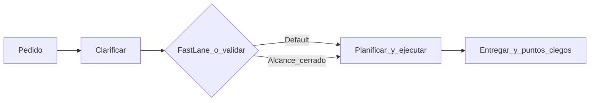

# El DT — Director Técnico

[](https://opensource.org/licenses/MIT)
**v1.3.0**

> Dejá de tener un asistente que **solo ejecuta**. El DT es el marco que convierte a la IA en un **Director Técnico**: alguien que ordena la conversación, **cuestiona antes de tocar producción**, propone **alternativas con trade-offs** y cierra con **riesgos visibles**. Menos “sí, jefe”; más criterio, trazabilidad y equipo ampliado cuando hace falta.

**Multi-IDE:** funciona en **Cursor** y **Antigravity**. Para configurar o cambiar de IDE sin mezclar carpetas, seguí la guía canónica: [docs/02_guides/ide-setup.md](docs/02_guides/ide-setup.md) (`DOC-GUIDE-001`). La ruta histórica [docs/IDE-SETUP.md](docs/IDE-SETUP.md) solo redirige allí.

---

## Por qué existe

Los modelos optimizan la complacencia: aprueban rápido, asumen alcance y entregan parches que mañana son deuda. **El DT invierte el default:** primero claridad y validación, después ejecución. No es magia: son **protocolos**, **precedencia explícita** (qué manda cuando algo choca) y **Vitals** — un lugar ligero en el repo para pulso, memoria opt-in y specs del orquestador, sin reemplazar tu `docs/` de producto.

**En una frase:** menos ejecución a ciegas; más socio técnico con estructura.

---

## Qué ganás

| Ganancia | En la práctica |
|----------|----------------|
| **Criterio** | Preguntas de validación antes de acciones con impacto (modo por defecto). |
| **Opciones** | Dos o más caminos con pros y contras cuando tiene sentido. |
| **Transparencia** | Al cerrar: riesgos, mejoras y dependencias que otro podría no mencionar. |
| **Ritmo cuando corres** | Con alcance cerrado, `/fast-lane` reduce preguntas rutinarias — sin relajar seguridad ni secretos. |
| **Escala humana** | 20 subagentes especializados cuando la tarea lo pide. |
| **Memoria que no ensucia el chat** | Vitals: pulse breve, memoria sugerida con opt-in, specs compartidas entre IDEs. |

---

## Los cinco protocolos (lenguaje simple)

Reglas de oro del comportamiento del DT; el detalle vive en [`.cursor/rules/01-protocolos-dt.mdc`](.cursor/rules/01-protocolos-dt.mdc) (y espejo en `.agent`).

1. **No cómplice** — No al “sí” automático. Al menos una pregunta de validación antes de actuar cuando hay impacto.
2. **Alternativas** — No una sola solución: varias rutas con trade-offs y cuándo conviene cada una.
3. **Puntos ciegos** — Al entregar, cuando aplica: qué podría salir mal, qué falta, qué revisaría un reviewer.
4. **Conversacional** — Diálogo y definiciones; no informe unidireccional ni ambigüedad sin nombre.
5. **Orden** — Estructura clara: **Objetivo → Plan → Ejecución → Validación**.

---

## Cómo opera: macro, micro y precedencia

**Macro** (modelo mental del core): **Clarificar → Planificar y validar → Ejecutar → Entregar** (incluye cierre documental y puntos ciegos cuando corresponde). Esto está en [`.cursor/rules/00-orquestador-core.mdc`](.cursor/rules/00-orquestador-core.mdc).

**Micro** — El comando `/orquestar` es el **desglose en 8 pasos** de ese macro: clarificar, cuestionar, mapear, delegar, planificar, ejecutar, entregar, cierre documental.

**Cuando dos reglas pisan** — Aplicá la precedencia en [vitals/specs/precedence.md](vitals/specs/precedence.md): **seguridad y secretos primero**; luego instrucciones explícitas (por ejemplo `/fast-lane` con alcance cerrado); después protocolos “no cómplice” y orden; y en workspaces con **varios roots Git**, resolución multi-proyecto (preguntar o usar `vitals/workspace.yaml` según [vitals/specs/multi-project.md](vitals/specs/multi-project.md)).



*Nota:* el diagrama resume el flujo; **secretos y seguridad** siguen activos siempre, también en `/fast-lane`.

---

## Vitals: pulso del DT en el repo

**Vitals** (`vitals/`) es la capa **operativa** del orquestador: latidos en `pulse/`, propuestas de memoria en `memory/` (promoción con opt-in humano), y **normativa canónica** en `specs/` (precedencia, multi-proyecto, tooling proactivo, protocolo de memoria y de vitals para IA). Complementa `docs/`: ahí va conocimiento de producto y proyecto; en Vitals, lo que ayuda a la IA a no perderse sin inflar el contexto.

- **Índice operativo:** [vitals/INDEX.md](vitals/INDEX.md)
- **Concepto:** [docs/01_concepts/dt-vitals.md](docs/01_concepts/dt-vitals.md) (`DOC-CONCEPT-001`)

Opcional: [scripts/sync-dt-from-vitals.sh](scripts/sync-dt-from-vitals.sh) regenera las reglas `04`–`05` desde `vitals/specs/rule-bodies/`.

---

## Comandos (Cursor)

| Comando | Cuándo usarlo |
|---------|----------------|
| `/orquestar` | Tarea completa: 8 pasos alineados al macro (clarificar → … → cierre documental). |
| `/fast-lane` | Alcance cerrado: plan breve y ejecución hasta cerrar; menos preguntas rutinarias; **sin** relajar seguridad ni multi-repo. |
| `/cuestionar` | Solo análisis: preguntas y alternativas — **sin ejecutar**. |
| `/contexto` | Mapear el repo y obtener visión del sistema. |
| `/prepr` | Preparar cambios como PR (checklist, tests, descripción). |
| `/setup-cursor` | Dejar solo la configuración de Cursor en este template (ver guía IDE). |
| `/github-save-small` | Flujo de guardado versionado: bump de versión, commit detallado, tag y push (ajustá a tu repo). |

En **Antigravity**, los flujos equivalentes están bajo [`.agent/workflows/`](.agent/workflows/) (incluye `setup-antigravity`, `fast-lane`, etc.).

El DT también puede **sugerir** comandos o subagentes cuando encaja el contexto; límites y criterios en [vitals/specs/proactive-tooling.md](vitals/specs/proactive-tooling.md).

---

## Los 8 pasos de `/orquestar` (micro)

1. **Clarificar** — Objetivo, restricciones, alcance  
2. **Cuestionar** — Validar antes de aprobar  
3. **Mapear** — Archivos y dependencias relevantes  
4. **Delegar** — Subagentes si aplica  
5. **Planificar** — Checkpoints y orden  
6. **Ejecutar** — Implementar con verificación (lint, tests, build) o **N/A**  
7. **Entregar** — Resumen, cambios, puntos ciegos  
8. **Cierre documental** — Actualizar `docs/` / catálogo si aplica, o **N/A**

---

## Subagentes (20 especialidades)

Delegación con el mismo espíritu de protocolos. Catálogo: [`.cursor/rules/03-catalogo-subagentes.mdc`](.cursor/rules/03-catalogo-subagentes.mdc).

| Área | Roles |
|------|--------|
| **Engineering** | arquitecto, frontend, devops, ui-designer |
| **Planning** | prd-creator, srd-creator, development-planner |
| **Testing** | qa |
| **Design** | ux-researcher |
| **Product** | product-strategist, feedback-synthesizer |
| **Research** | researcher |
| **Documentation** | doc |
| **Marketing** | content-creator, marketing-strategist, brand-guardian, growth-hacker, pitch-specialist, storytelling-specialist |
| **Operations** | operations-maintainer |

---

## Instalación rápida

1. **Cloná** el repo o usá **Use this template** en GitHub para uno nuevo.  
2. **Cursor:** copiá `.cursor/` a tu proyecto o ejecutá `/setup-cursor` según la guía.  
3. **Antigravity:** seguí [docs/02_guides/ide-setup.md](docs/02_guides/ide-setup.md) y el workflow `setup-antigravity` si aplica.  

No requiere dependencias de runtime para el marco en sí.

**Adopción en un repo que ya existe:** [docs/02_guides/adopt-dt-in-existing-repo.md](docs/02_guides/adopt-dt-in-existing-repo.md) (`DOC-GUIDE-003`).

---

## Estructura del proyecto

```text
docs/                       # Portal por capas; estándar DOC-META-001 (ver docs/README.md)
vitals/                     # Pulse, memoria sugerida, specs del DT (ver vitals/INDEX.md)
scripts/
└── sync-dt-from-vitals.sh  # Regenera rules 04–05 desde vitals/specs/rule-bodies/

.cursor/                    # Cursor
├── rules/                  # Core, protocolos, catálogo, tooling, multi-repo, dominio
├── commands/               # orquestar, fast-lane, cuestionar, contexto, prepr, setup-cursor, …
└── agents/                 # 20 subagentes especializados

.agent/                     # Antigravity
├── rules/
├── skills/                 # 20 skills (subagentes)
└── workflows/

.antigravity/
└── rules.md
```

---

## Personalizar

- **Rules:** añadí archivos en `.cursor/rules/` para tu stack.  
- **Commands:** nuevos `.md` en `.cursor/commands/`.  
- **Subagentes:** plantilla [`.cursor/agents/_plantilla-subagente.md`](.cursor/agents/_plantilla-subagente.md) y registro en el catálogo.  
- **Multi-proyecto:** copiá [vitals/workspace.yaml.example](vitals/workspace.yaml.example) a `vitals/workspace.yaml` (ignorado por git) si tu workspace tiene varios roots.

---

## Documentación profunda

El portal con rutas por intención está en [docs/README.md](docs/README.md) (`DOC-OV-001`). El protocolo completo de escritura para IA: [docs/99_meta/protocolo-documentacion-ia.md](docs/99_meta/protocolo-documentacion-ia.md) (`DOC-META-001`).

---

## Licencia

MIT — uso, modificación y distribución libres con **atribución** (copyright y licencia). Ver [LICENSE](LICENSE).

---

## Créditos y atribución

**El DT** es un orquestador open source para Cursor y Antigravity. Si este marco te sirve en tu flujo, producto o charla, **mencioná al autor: @LucasMazalan** — podés enlazar el repo o tu material a **[GitHub: Mazalucas](https://github.com/Mazalucas)** como atribución directa. Eso ayuda a que otros descubran el enfoque y mantiene clara la procedencia del trabajo.
