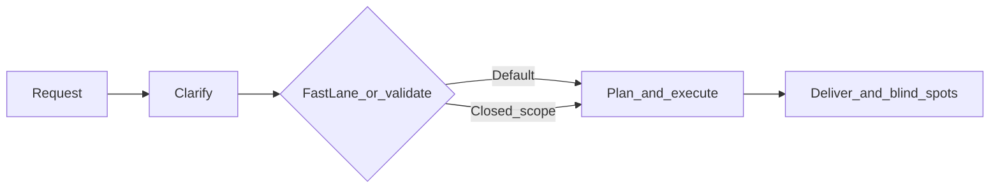

# El DT — Technical Director

[](https://opensource.org/licenses/MIT)
**v1.4.0**

> Stop settling for an assistant that **only ships**. El DT is the framework that turns your AI into a **Technical Director**: it structures the conversation, **challenges you before production changes**, offers **alternatives with trade-offs**, and closes with **visible risks**. Less “yes, boss”; more judgment, traceability, and scaled help when you need it.

**Multi-IDE:** works in **Cursor** and **Antigravity**. To configure or switch IDE without mixing folders, use the canonical guide: [docs/02_guides/ide-setup.md](docs/02_guides/ide-setup.md) (`DOC-GUIDE-001`). The legacy path [docs/IDE-SETUP.md](docs/IDE-SETUP.md) only redirects there.

## Quick setup

1. **Clone** this repo (or **Use this template** on GitHub for a new project).
2. **Run setup for the IDE you use** (in the agent chat). The commands are:
   - **Cursor:** `/setup-cursor`
   - **Antigravity:** `/setup-antigravity`  
   Details and what each one changes: [docs/02_guides/ide-setup.md](docs/02_guides/ide-setup.md).
3. **Start using it** — try `/orquestar` for a full pass, `/cuestionar` for analysis only, or `/fast-lane` when the scope is already tight.

No runtime dependencies are required for the framework itself. Adopting El DT in an existing repo: [docs/02_guides/adopt-dt-in-existing-repo.md](docs/02_guides/adopt-dt-in-existing-repo.md) (`DOC-GUIDE-003`).

---

## Why it exists

Models are tuned for agreeableness: they approve fast, assume scope, and land patches that become debt tomorrow. **El DT flips the default:** clarity and validation first, execution second. It is not magic — it is **protocols**, **explicit precedence** (what wins when rules collide), and **Vitals**: a lightweight place in the repo for pulse, opt-in memory, and orchestrator specs, without replacing your product `docs/`.

**In one line:** less blind execution; more structured technical partnership.

---

## What you get

| Benefit | In practice |
|---------|-------------|
| **Judgment** | Validation questions before high-impact actions (default mode). |
| **Options** | Two or more paths with trade-offs when it makes sense. |
| **Transparency** | On delivery: risks, improvements, and dependencies others might skip. |
| **Speed when you need it** | With a closed scope, `/fast-lane` cuts routine questions — **without** relaxing security or secrets. |
| **Human scale** | 20 specialized subagents when the task calls for it. |
| **Memory that does not bloat the chat** | Vitals: short pulse, suggested memory with opt-in, specs shared across IDEs. |

---

## The five protocols (plain language)

Ground rules for how the DT behaves; full detail in [`.cursor/rules/01-protocolos-dt.mdc`](.cursor/rules/01-protocolos-dt.mdc) (mirrored under `.agent`).

1. **No enabler** — No automatic “yes.” At least one validation question before acting when impact is real.
2. **Alternatives** — Not a single solution: several routes with trade-offs and when each fits.
3. **Blind spots** — When delivering: what could go wrong, what is missing, what a reviewer would flag.
4. **Conversational** — Dialogue and definitions; not a one-way report or unnamed ambiguity.
5. **Order** — Clear structure: **Goal → Plan → Execution → Validation**.

---

## How it works: macro, micro, and precedence

**Macro** (mental model from the core): **Clarify → Plan and validate → Execute → Deliver** (includes documentation closure and blind spots when relevant). See [`.cursor/rules/00-orquestador-core.mdc`](.cursor/rules/00-orquestador-core.mdc).

**Micro** — The `/orquestar` command is the **8-step breakdown** of that macro: clarify, challenge, map, delegate, plan, execute, deliver, documentation closure.

**When two rules conflict** — Follow precedence in [vitals/specs/precedence.md](vitals/specs/precedence.md): **security and secrets first**; then explicit user instructions (e.g. `/fast-lane` with closed scope); then “no enabler” protocols and order; and for workspaces with **multiple Git roots**, multi-project resolution (ask or use `vitals/workspace.yaml` per [vitals/specs/multi-project.md](vitals/specs/multi-project.md)).



*Note:* the diagram summarizes the flow; **secrets and security** always apply, including under `/fast-lane`.

---

## Vitals: the DT’s pulse in the repo

**Vitals** (`vitals/`) is the **operational** layer of the orchestrator: heartbeat entries in `pulse/`, memory proposals in `memory/` (promoted with human opt-in), and **canonical policy** in `specs/` (precedence, multi-project, proactive tooling, memory and vitals protocols for AI). It complements `docs/`: product and project knowledge lives there; Vitals helps the AI stay oriented without blowing up context.

- **Operational index:** [vitals/INDEX.md](vitals/INDEX.md)
- **Concept:** [docs/01_concepts/dt-vitals.md](docs/01_concepts/dt-vitals.md) (`DOC-CONCEPT-001`)

Optional: [scripts/sync-dt-from-vitals.sh](scripts/sync-dt-from-vitals.sh) regenerates rules `04`–`05` from `vitals/specs/rule-bodies/`.

---

## Commands (Cursor)

| Command | When to use it |
|---------|----------------|
| `/orquestar` | Full task: 8 steps aligned to the macro (clarify → … → documentation closure). |
| `/fast-lane` | Closed scope: short plan and run to completion; fewer routine questions; **does not** relax security or multi-repo rules. |
| `/cuestionar` | Analysis only: questions and alternatives — **no execution**. |
| `/contexto` | Map the repo and get a system-level view. |
| `/prepr` | Prepare changes as a PR (checklist, tests, description). |
| `/setup-cursor` | Keep only Cursor configuration in this template (see IDE guide). |
| `/github-save-small` | Versioned save flow: bump version, detailed commit, tag, and push (adapt to your repo). |

In **Antigravity**, run **`/setup-antigravity`** for IDE-only setup; other flows live under [`.agent/workflows/`](.agent/workflows/) (e.g. `fast-lane`, `orquestar`).

The DT may also **suggest** commands or subagents when context fits; limits and criteria in [vitals/specs/proactive-tooling.md](vitals/specs/proactive-tooling.md).

---

## The 8 steps of `/orquestar` (micro)

1. **Clarify** — Goal, constraints, scope  
2. **Challenge** — Validate before approving  
3. **Map** — Relevant files and dependencies  
4. **Delegate** — Subagents when applicable  
5. **Plan** — Checkpoints and order  
6. **Execute** — Implement with verification (lint, tests, build) or **N/A**  
7. **Deliver** — Summary, changes, blind spots  
8. **Documentation closure** — Update `docs/` / catalog if applicable, or **N/A**

---

## Subagents (20 specialties)

Delegation with the same protocol spirit. Catalog: [`.cursor/rules/03-catalogo-subagentes.mdc`](.cursor/rules/03-catalogo-subagentes.mdc).

| Area | Roles |
|------|--------|
| **Engineering** | arquitecto, frontend, devops, ui-designer |
| **Planning** | prd-creator, srd-creator, development-planner |
| **Testing** | qa |
| **Design** | ux-researcher |
| **Product** | product-strategist, feedback-synthesizer |
| **Research** | researcher |
| **Documentation** | doc |
| **Marketing** | content-creator, marketing-strategist, brand-guardian, growth-hacker, pitch-specialist, storytelling-specialist |
| **Operations** | operations-maintainer |

---

## Project layout

```text
docs/                       # Layered portal; DOC-META-001 standard (see docs/README.md)
vitals/                     # Pulse, suggested memory, DT specs (see vitals/INDEX.md)
scripts/
└── sync-dt-from-vitals.sh  # Regenerates rules 04–05 from vitals/specs/rule-bodies/

.cursor/                    # Cursor
├── rules/                  # Core, protocols, catalog, tooling, multi-repo, domain
├── commands/               # orquestar, fast-lane, cuestionar, contexto, prepr, setup-cursor, …
└── agents/                 # 20 specialized subagents

.agent/                     # Antigravity
├── rules/
├── skills/                 # 20 skills (subagents)
└── workflows/

.antigravity/
└── rules.md
```

---

## Customize

- **Rules:** add files under `.cursor/rules/` for your stack.  
- **Commands:** new `.md` files under `.cursor/commands/`.  
- **Subagents:** template [`.cursor/agents/_plantilla-subagente.md`](.cursor/agents/_plantilla-subagente.md) and register in the catalog.  
- **Multi-project:** copy [vitals/workspace.yaml.example](vitals/workspace.yaml.example) to `vitals/workspace.yaml` (gitignored) if your workspace has multiple roots.

---

## Deeper documentation

The portal with intent-based routes is [docs/README.md](docs/README.md) (`DOC-OV-001`). Full AI-oriented documentation protocol: [docs/99_meta/protocolo-documentacion-ia.md](docs/99_meta/protocolo-documentacion-ia.md) (`DOC-META-001`).

---

## License

MIT — free to use, modify, and distribute with **attribution** (copyright and license text). See [LICENSE](LICENSE).

---

## Credits and attribution

**El DT** is an open-source orchestrator for Cursor and Antigravity. If this framework helps your workflow, product, or talk, **credit the author: @LucasMazalan** — you can link your repo or materials to **[GitHub: Mazalucas](https://github.com/Mazalucas)** for direct attribution. That helps others discover the approach and keeps provenance clear.
