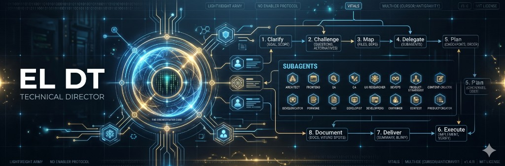
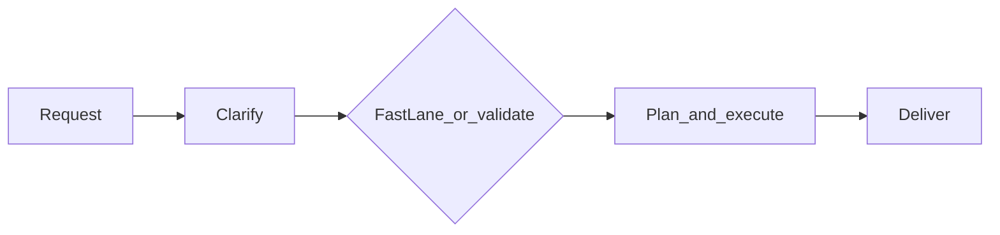

# El DT — Director de proyecto con IA

[](https://opensource.org/licenses/MIT)
**v1.7.10**

*Tu IA con equipo, criterio y herramientas — no un chat que dice “sí” a todo.*

**El DT** es un Director de Proyecto para tu IA: no solo ejecuta — **organiza el trabajo**, **te hace preguntas antes de avanzar**, **propone alternativas** y **te avisa de riesgos** antes de cerrar.

Delega en **22 especialistas** (producto, diseño, marketing, documentación, calidad…) y trae herramientas listas para:

- **Páginas web y productos digitales** — landings, dashboards, pantallas de login ([Atelier](#atelier--diseño-web-y-presentaciones))
- **Presentaciones y pitches** — decks, slides, material para inversores ([Atelier](#atelier--diseño-web-y-presentaciones))
- **Videos** — promos, explainers, motion graphics ([Remotion](#remotion--videos))
- **Marketing** — copy, SEO, campañas, lanzamientos ([42 skills tácticas](#marketing--42-skills-tácticas))

Todo desde el chat de tu editor (**Cursor**, **Antigravity**, **Claude Code** y más). **Empezá en 2 minutos:** [`/bienvenida`](#primera-vez) → [`/yo`](#ritual-del-día).

> **El DT no es un prompt:** es un cerebro operativo con ~1.400 documentos canónicos, ~56.000 líneas de orquestación, 22 especialistas, 105 skills y un ecosistema de diseño/marketing/video que suma cientos de miles de líneas de plantillas listas para usar.

---

## Índice

- [Empezá acá](#empezá-acá)
- [Ritual del día](#ritual-del-día)
- [Qué puede hacer El DT](#qué-puede-hacer-el-dt)
- [Comandos principales](#comandos-principales)
- [Google Drive — `/drive`](#google-drive--drive)
- [Atelier · Remotion · Marketing](#atelier--diseño-web-y-presentaciones)
- [Quick setup (English)](#quick-setup-english)
- [Para el equipo técnico](#para-el-equipo-técnico)

---

## Empezá acá

| Si querés… | Hacé esto |
|------------|-----------|
| Usar El DT por primera vez | `/bienvenida` → `/yo` |
| Trabajar en el día a día | `/actualizar` → `/yo` → trabajar → `/guardar` |
| Una tarea grande, paso a paso | `/orquestar` |
| Algo puntual ya definido | `/fast-lane` |
| Diseñar una web, dashboard o presentación | `/atelier` |
| Crear un video | `/remotion` |
| Consultar documentos en Google Drive | `/drive` (opcional — ver [abajo](#google-drive--drive)) |
| Ver el equipo completo de especialistas | [Catálogo de 22](#catálogo-de-los-22-especialistas) |

Este repo es **memoria compartida + reglas** para que varias personas trabajen con la misma IA sin pisarse. Guía humana: [cerebro del equipo](docs/00_overview/cerebro-equipo-mecanismos-dt.md). La IA lee **[AGENTS.md](AGENTS.md)** al entrar al proyecto.

### Primera vez {#primera-vez}

```bash
git clone <este-repo>
cd El-DT-Lightweight-Army
```

En el chat: **`/bienvenida`** → **`/yo`** (ej. *"Soy Ana García, analista"*). Guía detallada: [primer-setup-dt.md](docs/02_guides/primer-setup-dt.md).

No hace falta `/actualizar` en un clone recién hecho — usalo cuando el remoto del producto o del template tenga novedades.

---

## Ritual del día {#ritual-del-día}

```text
/actualizar  →  /yo  →  trabajar  →  /guardar
```

| Paso | Qué hace |
|------|----------|
| **`/actualizar`** | Sincronizar tu proyecto (`origin`) y avisar si hay release nuevo del framework DT |
| **`/yo`** | Decir quién sos en esta computadora |
| **Trabajar** | Pedir lo que necesites (`/orquestar`, diseño, video, docs…) |
| **`/guardar`** | Subir tu trabajo — bump de versión, sync y tag (sin secretos ni datos privados) |
| **`/drive`** | Conectar Google Drive y elegir carpetas como contexto del cerebro (opcional) |

Si la IA no sabe quién sos, te pedirá **`/yo`** antes de escribir en el repo. Tu identidad en esta PC **no se sube a GitHub** — es privada.

### Tarjeta pegable al monitor

```text
  bienvenida → yo → trabajar → guardar
  actualizar = proyecto + aviso si hay DT nuevo
  actualizar-dt = cuando quieras incorporar el framework
  drive = Google Drive (carpetas que elijas, solo en tu PC)
  tu identidad en esta PC = solo local
```

---

## Qué puede hacer El DT

| Bloque | En pocas palabras |
|--------|-------------------|
| **Orquestación** | Clarifica qué querés, planifica, ejecuta y cierra señalando riesgos. Comando principal: `/orquestar`. |
| **22 especialistas** | Producto, diseño, marketing, documentación, calidad… El DT elige quién ayuda según tu pedido. |
| **Atelier (diseño)** | Landings, dashboards, login, presentaciones — con criterio estético y guardrails anti-“diseño genérico de IA”. |
| **Videos y contenido** | Videos promocionales; marketing con copy, SEO, lanzamientos y campañas. |


```mermaid
flowchart TB
  vos[Vos en el chat]
  dt[El DT — orquestador]
  esp[22 especialistas]
  atelier[Atelier — webs y presentaciones]
  video[Videos — Remotion]
  mkt[Marketing — 42 skills]
  vos --> dt
  dt --> esp
  esp --> atelier
  esp --> video
  esp --> mkt
```

### Los cinco protocolos

El DT no es un ejecutor pasivo. Siempre aplica:

1. **Validar antes de actuar** — te pregunta antes de cambios importantes.
2. **Alternativas** — propone caminos con pros y contras.
3. **Puntos ciegos** — riesgos y mejoras visibles al cerrar.
4. **Conversacional** — diálogo, no informe unidireccional.
5. **Orden** — objetivo → plan → ejecución → validación.

Detalle: [protocolos DT](.cursor/rules/01-protocolos-dt.mdc).

---

## Comandos principales

| Comando | Para qué sirve |
|---------|----------------|
| **`/bienvenida`** | Primera vez — verificar que El DT está listo |
| **`/actualizar`** | Sincronizar tu proyecto y avisar si hay DT nuevo |
| **`/actualizar-dt`** | Incorporar release del framework DT (cuando /actualizar avise) |
| **`/yo`** | Decir quién sos en esta máquina |
| **`/guardar`** | Subir tu trabajo — bump patch, sync README/paquetes, tag `vX.Y.Z` |
| **`/drive`** | Conectar Google Drive y registrar carpetas para que la IA las consulte |
| **`/orquestar`** | Tarea grande — pipeline completo en 8 pasos |
| **`/fast-lane`** | Algo puntual ya definido — menos preguntas rutinarias |
| **`/cuestionar`** | Solo análisis — sin ejecutar |
| **`/contexto`** | Mapa del repo cuando entrás o después de un pull grande |
| **`/prepr`** | Preparar cambios como pull request |
| **`/atelier`** | Diseñar webs, dashboards o presentaciones |
| **`/remotion`** | Crear videos (promos, explainers, motion) |
| **`/setup`** | Reparar configuración del editor tras un pull grande |

Grupos completos y taglines: [commands-meta.yaml](vitals/config/commands-meta.yaml).

---

## Google Drive — `/drive` {#google-drive--drive}

Integración **opcional**: conectá **solo las carpetas que elijas** de Google Drive para que el DT las use como contexto al responder (briefs, reportes, docs de cliente). **No movés archivos al repo** y **nada de Drive se sube a GitHub** — credenciales, tokens y la lista de carpetas viven solo en tu máquina.

### Para qué sirve

| Situación | Qué hace `/drive` |
|-----------|-------------------|
| Primera vez | OAuth con tu cuenta Google, registra el MCP en Cursor/Antigravity, elegís carpetas |
| Ya conectado | Cambiar qué carpetas compartís al cerebro o revisar la config local |
| En el chat | La IA lee Docs/Sheets/Slides/PDF de esas carpetas vía MCP cuando el pedido lo amerita |

### Cómo usarlo

1. **`/yo`** — identidad local (requisito del DT).
2. **`/drive`** — el DT te guía paso a paso:
   - Pedí el archivo **`dt-drive-credentials.json`** al canal interno de tu empresa (nunca va al repo).
   - Corre **`./scripts/setup-drive.sh`** (o dejá que la IA lo ejecute) y reiniciá el IDE si hace falta.
   - Elegí **Shared Drives** o carpetas de “Mi unidad” y describí en una frase qué contiene cada una.
3. **Trabajá normal** — pedí en lenguaje natural: *“según el brief en Drive…”*, *“resume el doc de la carpeta X”*.

La selección queda en **`vitals/config/drive-context.yaml`** (local, no Git). Alcance de lectura: **solo lectura** (`drive.readonly`).

**Guía completa:** [drive-cerebro-setup.md](docs/02_guides/drive-cerebro-setup.md) · **Admin GCP:** [drive-google-cloud-admin.md](docs/06_operations/drive-google-cloud-admin.md)

---

## Atelier — diseño web y presentaciones

**Atelier** es la capacidad de diseño de El DT: landings, dashboards, flujos de login, pitches y decks — con selección de design system, tokens y revisión anti-slop.

| Comando | Ejemplo |
|---------|---------|
| `/atelier init` | Crear contexto de diseño del proyecto |
| `/atelier select [brief]` | Elegir estilo y sistema según tu pedido |
| `/atelier detect [path]` | Detectar patrones genéricos de IA en el código |
| `/atelier polish [target]` | Pasada final antes de entregar |

Incluye **6 design systems** (Material, Apple HIG, Fluent, Carbon, Polaris, Atlassian), **5 lenguajes visuales** (Swiss, Bauhaus, minimalismo, neumorphism, glass) y biblioteca de plantillas.

- Concepto: [Atelier en El DT](docs/01_concepts/design-atelier-el-dt.md)
- Índice de skills: [.cursor/skills/design/README.md](.cursor/skills/design/README.md)
- Plantillas: [.cursor/skills/design/templates/INDEX.md](.cursor/skills/design/templates/INDEX.md)

Orquestador: **ui-designer** · Implementación en código: **frontend**.

---

## Remotion — videos

**Remotion** convierte videos en composiciones React: promos, explainers, motion graphics, renders MP4.

| Comando | Ejemplo |
|---------|---------|
| `/remotion init` | Arrancar un proyecto de video |
| `/remotion promo 30s 9:16` | Video promocional vertical |

Flujo típico: **marketing-strategist** (guion) → **remotion-producer** (composición y render).

- Toolkit: [tools/remotion/](tools/remotion/)
- Registro de tools: [tools/REGISTRY.md](tools/REGISTRY.md)

---

## Marketing — 42 skills tácticas

**marketing-strategist** coordina **42 skills especializadas**: copy, SEO, ads, lanzamientos, email, pricing, CRO y más.

- Índice completo: [.cursor/skills/marketing/README.md](.cursor/skills/marketing/README.md)
- Contexto de producto (local): `.agents/product-marketing.md`

[Ver listado completo de skills ↓](#marketing-strategist--42-skills-tácticas)

---

## Quick setup (English)

1. **Clone** this repo (or **Use this template** on GitHub).
2. In chat: **`/bienvenida`** then **`/yo`** — see [primer-setup-dt.md](docs/02_guides/primer-setup-dt.md).
3. **Daily ritual:** `/actualizar` → `/yo` → work → `/guardar`
4. **Design:** `/atelier` · **Video:** `/remotion` · **Deep work:** `/orquestar` or `/fast-lane`
5. **Repair IDE drift:** `/setup` — see [ide-setup.md](docs/02_guides/ide-setup.md)

Adopting El DT in an existing repo: [adopt-dt-in-existing-repo.md](docs/02_guides/adopt-dt-in-existing-repo.md).

Works in **Cursor**, **Antigravity**, **Claude Code**, **Codex** and **GitHub Copilot**.

---

## Para el equipo técnico

### El DT mantiene el proyecto ordenado

Tras cambios importantes en documentación, reglas o estructura, El DT verifica que todo siga coherente (frontmatter, catálogo, enlaces, paridad entre editores). Motor: [`scripts/dt-doctor.sh`](scripts/dt-doctor.sh). Detalle: regla `07-orden-continuo` · [precedence](vitals/specs/precedence.md).

### Orquestación — macro vs micro

**Macro:** Clarificar → Planificar → Ejecutar → Entregar.

**Micro:** `/orquestar` = 8 pasos (clarificar … cierre documental).


```mermaid
flowchart LR
  req[Request]
  clarify[Clarify]
  gate{FastLane_or_validate}
  planExec[Plan_and_execute]
  deliver[Deliver]
  req --> clarify --> gate --> planExec --> deliver
```

Seguridad y secretos **siempre** aplican, incluso bajo `/fast-lane`.

### Vitals

| Layer | Path |
|-------|------|
| Index | [vitals/INDEX.md](vitals/INDEX.md) |
| Session (local) | `vitals/ops/session.yaml` |
| Team roster | `vitals/config/roster.yaml` |
| Commands meta | `vitals/config/commands-meta.yaml` |
| Concept doc | [docs/01_concepts/dt-vitals.md](docs/01_concepts/dt-vitals.md) |

| Script | Uso |
|--------|-----|
| [dt-doctor.sh](scripts/dt-doctor.sh) | Verificador read-only del orden |
| [sync-ide.sh](scripts/sync-ide.sh) | Emisor único multi-IDE (rules, skills, commands) |
| [sync-catalog.rb](scripts/sync-catalog.rb) | Catálogo de docs derivado del frontmatter |
| [sync-commands-from-meta.sh](scripts/sync-commands-from-meta.sh) | Commands desde `commands-meta.yaml` |
| [sync-skills-parity.sh](scripts/sync-skills-parity.sh) | Skills `.cursor/skills` → `.agents/skills` |

Detalle: [scripts/README.md](scripts/README.md).

### Subagentes (22) — resumen por grupo

| Grupo | Especialistas | Ejemplos de uso |
|-------|---------------|-----------------|
| **Engineering** | arquitecto, frontend, devops, ui-designer, remotion-producer | APIs, UI, deploy, Atelier, video |
| **Planning** | prd-creator, srd-creator, development-planner | PRD, specs técnicas, roadmap |
| **Testing** | qa, data-auditor | Tests, edge cases, verificación de números |
| **Design & UX** | ux-researcher | Personas, journey mapping |
| **Product** | product-strategist, feedback-synthesizer, researcher | Priorización, research |
| **Documentation** | doc | README, ADRs, docs por niveles |
| **Marketing & Content** | content-creator, marketing-strategist, brand-guardian, growth-hacker, pitch-specialist, storytelling-specialist | Copy, campañas, pitch, narrativa |
| **Operations** | operations-maintainer | Monitoreo, incidentes |

Fuente canónica de skills: [`.cursor/skills/`](.cursor/skills/) (espejo Antigravity/Claude vía `sync-ide`). Reglas de delegación: [`.cursor/rules/03-catalogo-subagentes.mdc`](.cursor/rules/03-catalogo-subagentes.mdc).

**Skills de rutina DT** (no son subagentes): `dt-setup`, `dt-session`, `git-actualizar`, `git-guardar`, `dt-drive`, `dt-actualizar`, `github-save-release`.

#### Catálogo de los 22 especialistas

| # | Subagente | Grupo | Rol | Invocar cuando (keywords) | Agente (Cursor) | Skill de rol |
|---|-----------|-------|-----|---------------------------|-----------------|--------------|
| 1 | **arquitecto** | Engineering | Backend, APIs, arquitectura, patrones | `backend`, `api`, `database`, `server`, `arquitectura`, `SRD` | [agente](.cursor/agents/arquitecto.md) | [`.cursor/skills/arquitecto/`](.cursor/skills/arquitecto/) |
| 2 | **frontend** | Engineering | UI, componentes, accesibilidad | `frontend`, `ui`, `ux`, `interface`, `client`, `componentes` | [agente](.cursor/agents/frontend.md) | [`.cursor/skills/frontend/`](.cursor/skills/frontend/) |
| 3 | **devops** | Engineering | CI/CD, infra, deploy | `deploy`, `infrastructure`, `ci/cd`, `devops`, `pipelines` | [agente](.cursor/agents/devops.md) | [`.cursor/skills/devops/`](.cursor/skills/devops/) |
| 4 | **ui-designer** | Engineering | Orquestador **Atelier** + specs UI | `UI design`, `mockups`, `Atelier`, `landing`, `dashboard`, `design system` | [agente](.cursor/agents/ui-designer.md) | [`.cursor/skills/ui-designer/`](.cursor/skills/ui-designer/) |
| 5 | **remotion-producer** | Engineering | Video programático **Remotion** | `Remotion`, `video programático`, `motion graphics`, `render MP4` | [agente](.cursor/agents/remotion-producer.md) | [`.cursor/skills/remotion-producer/`](.cursor/skills/remotion-producer/) |
| 6 | **prd-creator** | Planning | PRD, visión de producto, user stories | `product idea`, `requirements`, `PRD` | [agente](.cursor/agents/prd-creator.md) | [`.agents/skills/prd-creator/`](.agents/skills/prd-creator/) |
| 7 | **srd-creator** | Planning | SRD y specs técnicas desde PRD | `technical spec`, `SRD`, `PRD to technical` | [agente](.cursor/agents/srd-creator.md) | [`.agents/skills/srd-creator/`](.agents/skills/srd-creator/) |
| 8 | **development-planner** | Planning | Fases, MVP, roadmap, timelines | `development plan`, `phases`, `MVP`, `roadmap` | [agente](.cursor/agents/development-planner.md) | [`.agents/skills/development-planner/`](.agents/skills/development-planner/) |
| 9 | **qa** | Testing | Tests, edge cases, validación | `test`, `qa`, `quality`, `pruebas` | [agente](.cursor/agents/qa.md) | [`.cursor/skills/qa/`](.cursor/skills/qa/) |
| 10 | **ux-researcher** | Design & UX | Personas, journey, research UX | `user research`, `personas`, `UX`, `journey mapping` | [agente](.cursor/agents/ux-researcher.md) | [`.agents/skills/ux-researcher/`](.agents/skills/ux-researcher/) |
| 11 | **product-strategist** | Product | Priorización, roadmap de producto | `prioritization`, `roadmap`, `product strategy` | [agente](.cursor/agents/product-strategist.md) | [`.agents/skills/product-strategist/`](.agents/skills/product-strategist/) |
| 12 | **feedback-synthesizer** | Product | Síntesis de feedback en insights | `feedback`, `synthesis`, `insights` | [agente](.cursor/agents/feedback-synthesizer.md) | [`.agents/skills/feedback-synthesizer/`](.agents/skills/feedback-synthesizer/) |
| 13 | **researcher** | Product | Investigación y análisis de información | `research`, `analyze`, `investigate` | [agente](.cursor/agents/researcher.md) | [`.agents/skills/researcher/`](.agents/skills/researcher/) |
| 14 | **doc** | Documentation | Docs por niveles, README, ADRs | `document`, `docs`, `readme`, `documentación` | [agente](.cursor/agents/doc.md) | [`.agents/skills/doc/`](.agents/skills/doc/) |
| 15 | **content-creator** | Marketing & Content | Contenido multi-canal, SEO, brand | `content`, `copy` (contenido editorial) | [agente](.cursor/agents/content-creator.md) | [`.agents/skills/content-creator/`](.agents/skills/content-creator/) |
| 16 | **marketing-strategist** | Marketing & Content | Estrategia + **42 skills tácticas** | `marketing`, `CRO`, `SEO`, `ads`, `campaigns`, `growth` | [agente](.cursor/agents/marketing-strategist.md) | [`.cursor/skills/marketing-strategist/`](.cursor/skills/marketing-strategist/) |
| 17 | **brand-guardian** | Marketing & Content | Marca y brand guidelines | `brand`, `brand compliance` | [agente](.cursor/agents/brand-guardian.md) | [`.agents/skills/brand-guardian/`](.agents/skills/brand-guardian/) |
| 18 | **growth-hacker** | Marketing & Content | Experimentos y conversión | `growth`, `experiments`, `conversion` | [agente](.cursor/agents/growth-hacker.md) | [`.agents/skills/growth-hacker/`](.agents/skills/growth-hacker/) |
| 19 | **pitch-specialist** | Marketing & Content | Pitch inversores y stakeholders | `pitch`, `presentation`, `investors` | [agente](.cursor/agents/pitch-specialist.md) | [`.agents/skills/pitch-specialist/`](.agents/skills/pitch-specialist/) |
| 20 | **storytelling-specialist** | Marketing & Content | Narrativa y story arcs | `storytelling`, `narrative`, `story` | [agente](.cursor/agents/storytelling-specialist.md) | [`.agents/skills/storytelling-specialist/`](.agents/skills/storytelling-specialist/) |
| 21 | **operations-maintainer** | Operations | Monitoreo, incidentes, mantenimiento | `operations`, `monitoring`, `incidentes` | [agente](.cursor/agents/operations-maintainer.md) | [`.agents/skills/operations-maintainer/`](.agents/skills/operations-maintainer/) |
| 22 | **data-auditor** | Testing | Verificación de números y planillas con script (regla `16-numeric-grounding`) | `planilla`, `csv`, `excel`, `reporte`, `totales`, `reconciliar`, `verificar cifras` | [agente](.cursor/agents/data-auditor.md) | [`.cursor/skills/data-auditor/`](.cursor/skills/data-auditor/) |

#### Marketing strategist — 42 skills tácticas

Origen: [marketingskills](https://github.com/coreyhaines31/marketingskills) v2. Contexto compartido: `.agents/product-marketing.md` (local).

| IDE | Orquestadora | Pack táctico |
|-----|--------------|--------------|
| **Cursor** | [`.cursor/skills/marketing-strategist/`](.cursor/skills/marketing-strategist/) | [`.cursor/skills/marketing/{skill}/`](.cursor/skills/marketing/) |
| **Antigravity** | [`.agents/skills/marketing-strategist/`](.agents/skills/marketing-strategist/) | [`.agents/skills/marketing/{skill}/`](.agents/skills/marketing/) |

| Skill | Área |
|-------|------|
| `product-marketing` | Contexto de producto (base para todas) |
| `ab-testing` | Experimentación y A/B tests |
| `ad-creative` | Creatividades de ads |
| `ads` | Campañas pagadas (Google, Meta, LinkedIn, etc.) |
| `ai-seo` | SEO para motores / respuestas IA |
| `analytics` | Medición, GA4, tracking |
| `aso` | App Store / Google Play |
| `churn-prevention` | Retención, dunning, cancel flows |
| `co-marketing` | Partnerships y campañas conjuntas |
| `cold-email` | Outbound B2B |
| `community-marketing` | Comunidades y advocacy |
| `competitor-profiling` | Research de competidores (URLs) |
| `competitors` | Páginas comparison / alternatives |
| `content-strategy` | Estrategia de contenido |
| `copy-editing` | Editar copy existente |
| `copywriting` | Copy nuevo (landings, web) |
| `cro` | Conversión en páginas y forms |
| `customer-research` | Research de clientes |
| `directory-submissions` | Directorios startup/SaaS |
| `emails` | Secuencias y lifecycle email |
| `free-tools` | Herramientas gratis como lead gen |
| `image` | Imágenes de marketing (IA) |
| `launch` | Lanzamientos |
| `lead-magnets` | Lead magnets |
| `marketing-ideas` | Ideas e inspiración |
| `marketing-psychology` | Psicología y persuasión |
| `onboarding` | Activación post-signup |
| `paywalls` | Paywalls in-app |
| `popups` | Modales y overlays |
| `pricing` | Pricing y packaging |
| `programmatic-seo` | SEO programático |
| `prospecting` | Listas y calificación B2B |
| `referrals` | Referidos y afiliados |
| `revops` | RevOps y handoff marketing→ventas |
| `sales-enablement` | Collateral de ventas |
| `schema` | Schema markup |
| `seo-audit` | Auditoría SEO |
| `signup` | Flujos de registro |
| `site-architecture` | Arquitectura del sitio |
| `sms` | SMS/MMS marketing |
| `social` | Redes sociales |
| `video` | Video marketing (IA) |

#### Atelier — detalle técnico

Atelier 2.0: **Impeccable vendoreado** + pack design/ nativo. Contexto: `.agents/design-context.md` (local).

| IDE | Router | Pack táctico | Vendor |
|-----|--------|--------------|--------|
| **Cursor** | [`.cursor/skills/atelier/`](.cursor/skills/atelier/) | [`.cursor/skills/design/`](.cursor/skills/design/) | [`tools/atelier/`](tools/atelier/) |

Motores: `ruby scripts/dt-design-select.rb` · `./scripts/atelier-detect.sh` (Impeccable CLI, 44+ reglas)

Actualizar Impeccable: `./tools/atelier/scripts/sync-from-impeccable.sh --latest` → `./scripts/sync-ide.sh` (ver `DOC-GUIDE-008`)

#### Remotion — detalle técnico

Toolkit en **[`tools/remotion/`](tools/remotion/)** (starter + primitivas). Best practices vendor: **`remotion-best-practices`**.

Actualizar vendor skill: `./tools/remotion/scripts/update-vendor-skills.sh` → `./scripts/sync-ide.sh`

### Git: qué va y qué no va al remoto

| Path | ¿En Git? | Por qué |
|------|----------|---------|
| `vitals/ops/session.yaml` | **No** | Quién está en **esta** PC ahora |
| `vitals/config/roster.yaml` | **Sí** | Equipo registrado |
| `vitals/workspace.yaml` | **No** | Multi-repo local (plantilla: `.example`) |
| `.env`, `*.credentials` | **No** | Secretos |
| `.agents/product-marketing.md` | **No** | Contexto de producto local |
| `.agents/design-context.md` | **No** | Contexto de diseño local |
| `.cursor/`, `.agents/`, `docs/`, skills | **Sí** | Comportamiento de la IA |

### Project layout

```text
README.md / AGENTS.md / VERSION
tools/                              # Arsenal reutilizable — tools/REGISTRY.md
.agents/                            # Contexto local (product-marketing, design-context)
docs/                               # Portal de documentación
vitals/
  config/                           # commands-meta.yaml, roster.yaml, rules-manifest.yaml
  specs/rule-bodies/                # Cuerpos de reglas (fuente única)
  data/                             # Registries (design, engineering)
  ops/                              # session.yaml = local (/yo)
  pulse/ memory/ specs/
  work/inbox/{operator_id}/

.cursor/                            # rules, commands, agents, skills (canónico)
.agents/                            # Antigravity + Codex: rules, workflows, skills
.antigravity/                       # Entrada Antigravity (rules.md)
.claude/ .codex/                    # Espejos generados — no editar a mano
output/                             # Generaciones locales (gitignored)
```

Multi-IDE: [ide-targets.yaml](vitals/config/ide-targets.yaml) · Guía: [ide-setup.md](docs/02_guides/ide-setup.md).

### Personalización

1. **Reglas:** editar `vitals/specs/rule-bodies/<stem>.body.md` + `vitals/config/rules-manifest.yaml` → `./scripts/sync-ide.sh`
2. **Commands:** editar `vitals/config/commands-meta.yaml` → `./scripts/sync-commands-from-meta.sh`
3. **Skills:** canónico en `.cursor/skills/` → `./scripts/sync-ide.sh`
4. **Multi-proyecto:** `vitals/workspace.yaml` desde [workspace.yaml.example](vitals/workspace.yaml.example)
5. **Verificar:** `./scripts/dt-doctor.sh`

### Documentation portal

- [docs/README.md](docs/README.md) — portal principal
- [Atelier templates](docs/03_reference/atelier-templates-index.md)
- [Tools registry](docs/03_reference/tools-registry.md)
- [Protocolo documentación IA](docs/99_meta/protocolo-documentacion-ia.md)

---

## License

MIT — see [LICENSE](LICENSE). Attribution: **@LucasMazalan** · [GitHub: Mazalucas](https://github.com/Mazalucas).
