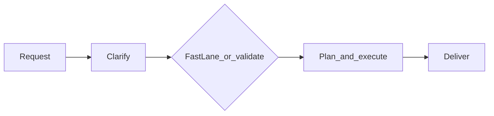

# El DT — Technical Director

[](https://opensource.org/licenses/MIT)
**v1.6.2**

> Stop settling for an assistant that **only ships**. El DT is the framework that turns your AI into a **Technical Director**: it structures the conversation, **challenges you before production changes**, offers **alternatives with trade-offs**, and closes with **visible risks**.

**Multi-IDE:** Cursor and Antigravity — [docs/02_guides/ide-setup.md](docs/02_guides/ide-setup.md) (`DOC-GUIDE-001`).

---

## Cerebro del equipo — empezá acá

Este repo es **memoria versionada + reglas** para que varias personas trabajen con la misma IA sin pisarse. La referencia técnica completa está en **[docs/00_overview/cerebro-equipo-mecanismos-dt.md](docs/00_overview/cerebro-equipo-mecanismos-dt.md)** (`DOC-OV-004`). La IA debe leer **[AGENTS.md](AGENTS.md)** al entrar al proyecto.

### Ritual diario (regla de oro)

```text
/actualizar  →  /yo  →  trabajar  →  /guardar
```

| Paso | Qué hace |
|------|----------|
| **`/actualizar`** | Baja cambios del equipo (`git pull --rebase`); **no** toca tu sesión local |
| **`/yo`** | Decís quién sos hoy — la laptop no lo adivina |
| **Trabajar** | `/orquestar`, `/fast-lane`, código, docs, pulse… |
| **`/guardar`** | Subís a GitHub **sin** subir `session.yaml` ni secretos |

Si **no tenés sesión** (`vitals/ops/session.yaml`), la IA te pedirá **`/yo`** antes de escribir en el repo. La sesión **solo se crea con `/yo`** (no copies archivos a mano).

### Primera vez en esta máquina

```bash
git clone <este-repo>
cd El-DT-Lightweight-Army
```

En el chat: **`/actualizar`** → **`/yo`** (ej. *"Soy Ana García, analista"*) — opcional **`/setup-cursor`** o **`/setup-antigravity`** si querés un solo IDE.

### Git: qué va y qué no va al remoto

| Path | ¿En Git? | Por qué |
|------|----------|---------|
| `vitals/ops/session.yaml` | **No** | Quién está en **esta** PC ahora |
| `vitals/config/roster.yaml` | **Sí** | Equipo registrado |
| `vitals/workspace.yaml` | **No** | Multi-repo local (plantilla: `.example`) |
| `.env`, `*.credentials` | **No** | Secretos |
| `.cursor/`, `.agent/`, `.agents/README.md`, `docs/`, skills | **Sí** | Comportamiento de la IA |
| `.agents/product-marketing.md` | **No** | Contexto de producto local |

### Commands (resumen)

Fuente canónica de taglines y grupos: **[vitals/config/commands-meta.yaml](vitals/config/commands-meta.yaml)**

| Grupo | Commands |
|-------|----------|
| **Rutina** | `/actualizar` · `/yo` · `/guardar` |
| **Trabajo** | `/orquestar` · `/fast-lane` · `/cuestionar` · `/contexto` · `/prepr` |
| **Framework** | `/setup-cursor` · `/setup-antigravity` · `/github-save-small` |

En **Antigravity**, los de rutina están en [`.agent/workflows/`](.agent/workflows/) (`actualizar`, `yo`, `guardar`); la lógica vive en [`.agent/skills/`](.agent/skills/) (ver [.antigravity/rules.md](.antigravity/rules.md)).

### Tarjeta pegable al monitor

```text
  actualizar → yo → trabajar → guardar
  session.yaml = solo en tu PC
```

---

## Quick setup (English)

1. **Clone** this repo (or **Use this template** on GitHub).
2. **IDE setup** in chat: `/setup-cursor` or `/setup-antigravity` — see [ide-setup.md](docs/02_guides/ide-setup.md).
3. **Daily ritual:** `/actualizar` → `/yo` (si no hay sesión; la IA también lo pide) → work → `/guardar`
5. **Deep work:** `/orquestar` (full pipeline) or `/fast-lane` (closed scope)

Adopting El DT in an existing repo: [adopt-dt-in-existing-repo.md](docs/02_guides/adopt-dt-in-existing-repo.md) (`DOC-GUIDE-003`).

---

## Why it exists

Models default to agreeableness. **El DT flips that:** clarity and validation first, execution second — **protocols**, **precedence** ([vitals/specs/precedence.md](vitals/specs/precedence.md)), and **Vitals** (pulse, opt-in memory, specs) without replacing your product `docs/`.

---

## The five protocols

Detail: [`.cursor/rules/01-protocolos-dt.mdc`](.cursor/rules/01-protocolos-dt.mdc)

1. **No enabler** — Validate before high-impact actions.
2. **Alternatives** — Multiple paths with trade-offs.
3. **Blind spots** — Risks and reviewer flags on delivery.
4. **Conversational** — Dialogue, not one-way reports.
5. **Order** — Goal → Plan → Execution → Validation.

---

## Macro vs micro

**Macro:** Clarify → Plan and validate → Execute → Deliver ([`00-orquestador-core`](.cursor/rules/00-orquestador-core.mdc)).

**Micro:** `/orquestar` = 8 steps (clarify … documentation closure).


```mermaid
flowchart LR
  req[Request]
  clarify[Clarify]
  gate{FastLane_or_validate}
  planExec[Plan_and_execute]
  deliver[Deliver]
  req --> clarify --> gate --> planExec --> deliver
```

Security and secrets **always** apply, including under `/fast-lane`.

---

## Vitals

| Layer | Path |
|-------|------|
| Index | [vitals/INDEX.md](vitals/INDEX.md) |
| Session (local) | `vitals/ops/session.yaml` |
| Team roster | `vitals/config/roster.yaml` |
| Commands meta | `vitals/config/commands-meta.yaml` |
| Concept doc | [docs/01_concepts/dt-vitals.md](docs/01_concepts/dt-vitals.md) |

| Script | Uso |
|--------|-----|
| [sync-dt-from-vitals.sh](scripts/sync-dt-from-vitals.sh) | Rules `04`–`05` desde `vitals/specs/rule-bodies/` |
| [sync-commands-from-meta.sh](scripts/sync-commands-from-meta.sh) | Commands en Cursor + Antigravity desde `commands-meta.yaml` |
| [sync-skills-parity.sh](scripts/sync-skills-parity.sh) | Skills `.cursor/skills` → `.agent/skills` (incl. árbol `marketing/*`) |

Detalle: [scripts/README.md](scripts/README.md).

---

## Subagents (20)

Catálogo general: [`.cursor/rules/03-catalogo-subagentes.mdc`](.cursor/rules/03-catalogo-subagentes.mdc) — arquitecto, frontend, qa, doc, …

---

## Marketing strategist — 42 skills

El subagente **`marketing-strategist`** combina estrategia de marketing con **42 skills tácticas** (CRO, SEO, ads, copy, growth, RevOps, etc.), integradas desde [marketingskills](https://github.com/coreyhaines31/marketingskills) v2.

### Disponibles en todos los IDEs

| IDE | Agente / skill orquestadora | Skills tácticas (árbol completo) |
|-----|------------------------------|----------------------------------|
| **Cursor** | [`.cursor/agents/marketing-strategist.md`](.cursor/agents/marketing-strategist.md) · [`.cursor/skills/marketing-strategist/SKILL.md`](.cursor/skills/marketing-strategist/SKILL.md) | [`.cursor/skills/marketing/{skill}/`](.cursor/skills/marketing/) |
| **Antigravity** | [`.agent/skills/marketing-strategist/SKILL.md`](.agent/skills/marketing-strategist/SKILL.md) | [`.agent/skills/marketing/{skill}/`](.agent/skills/marketing/) |

**Fuente canónica en Git:** `.cursor/skills/marketing/` (incluye `SKILL.md`, `references/`, `evals/`). Antigravity usa el espejo en `.agent/skills/marketing/` — mantener con:

```bash
./scripts/sync-skills-parity.sh
```

**Contexto de producto** (todas las skills lo leen primero): `.agents/product-marketing.md` — crear con la skill `product-marketing`; archivo **local** (no va a Git). Ver [`.agents/README.md`](.agents/README.md).

**Índice detallado:** [`.cursor/skills/marketing/README.md`](.cursor/skills/marketing/README.md)

### Catálogo de skills

| Skill | Área |
|-------|------|
| `product-marketing` | Contexto de producto (base para todas) |
| `ab-testing` | Experimentación y A/B tests |
| `ad-creative` | Creatividades de ads |
| `ads` | Campañas pagadas (Google, Meta, LinkedIn, etc.) |
| `ai-seo` | SEO para motores / respuestas IA |
| `analytics` | Medición, GA4, tracking |
| `aso` | App Store / Google Play |
| `churn-prevention` | Retención, dunning, cancel flows |
| `co-marketing` | Partnerships y campañas conjuntas |
| `cold-email` | Outbound B2B |
| `community-marketing` | Comunidades y advocacy |
| `competitor-profiling` | Research de competidores (URLs) |
| `competitors` | Páginas comparison / alternatives |
| `content-strategy` | Estrategia de contenido |
| `copy-editing` | Editar copy existente |
| `copywriting` | Copy nuevo (landings, web) |
| `cro` | Conversión en páginas y forms |
| `customer-research` | Research de clientes |
| `directory-submissions` | Directorios startup/SaaS |
| `emails` | Secuencias y lifecycle email |
| `free-tools` | Herramientas gratis como lead gen |
| `image` | Imágenes de marketing (IA) |
| `launch` | Lanzamientos |
| `lead-magnets` | Lead magnets |
| `marketing-ideas` | Ideas e inspiración |
| `marketing-psychology` | Psicología y persuasión |
| `onboarding` | Activación post-signup |
| `paywalls` | Paywalls in-app |
| `popups` | Modales y overlays |
| `pricing` | Pricing y packaging |
| `programmatic-seo` | SEO programático |
| `prospecting` | Listas y calificación B2B |
| `referrals` | Referidos y afiliados |
| `revops` | RevOps y handoff marketing→ventas |
| `sales-enablement` | Collateral de ventas |
| `schema` | Schema markup |
| `seo-audit` | Auditoría SEO |
| `signup` | Flujos de registro |
| `site-architecture` | Arquitectura del sitio |
| `sms` | SMS/MMS marketing |
| `social` | Redes sociales |
| `video` | Video marketing (IA) |

**Uso:** delegá en `marketing-strategist` (p. ej. “auditoría SEO”, “copy de pricing”) o pedí la skill por nombre; el agente carga `marketing/{skill}/SKILL.md` y sus referencias.

---

## Project layout

```text
README.md / AGENTS.md / VERSION
.agents/                    # README + product-marketing.md (local)
docs/                       # Portal DOC-META-001 — cerebro DOC-OV-004
vitals/
  config/                   # commands-meta.yaml, roster.yaml
  ops/                      # README schema; session.yaml = local (/yo)
  pulse/ memory/ specs/
  work/inbox/{operator_id}/ # cuaderno personal opcional

.cursor/                    # rules, commands, agents, skills (+ marketing/)
.agent/                     # Antigravity: rules, workflows, skills (+ marketing/)
```

---

## Customize

- **Rules:** `.cursor/rules/` for your stack.
- **Commands:** edit `vitals/config/commands-meta.yaml` first, then `.cursor/commands/` and `.agent/workflows/`.
- **Multi-project:** `vitals/workspace.yaml` from [workspace.yaml.example](vitals/workspace.yaml.example).

---

## Documentation portal

[docs/README.md](docs/README.md) (`DOC-OV-001`) · Protocol: [docs/99_meta/protocolo-documentacion-ia.md](docs/99_meta/protocolo-documentacion-ia.md)

---

## License

MIT — see [LICENSE](LICENSE). Attribution: **@LucasMazalan** · [GitHub: Mazalucas](https://github.com/Mazalucas).
