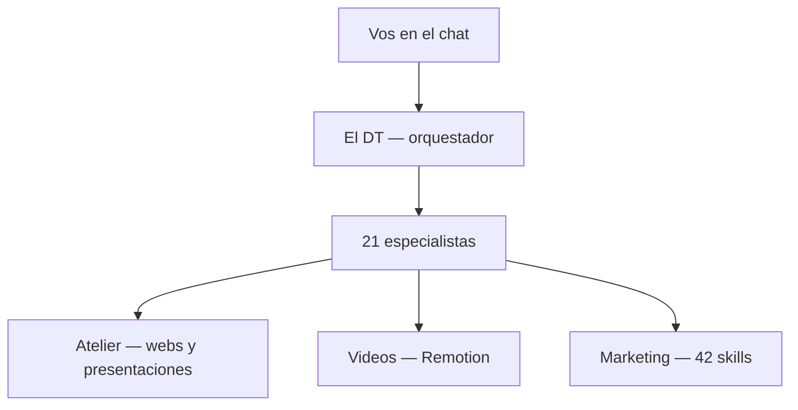
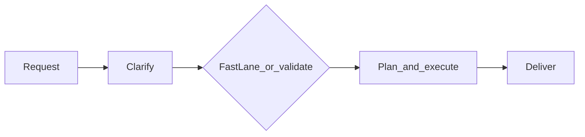

# El DT — Technical Director

[](https://opensource.org/licenses/MIT)
**v1.7.3**

> Stop settling for an assistant that **only ships**. El DT is the framework that turns your AI into a **Technical Director**: it structures the conversation, **challenges you before production changes**, offers **alternatives with trade-offs**, and closes with **visible risks**.

**Multi-IDE:** Cursor and Antigravity — [docs/02_guides/ide-setup.md](docs/02_guides/ide-setup.md) (`DOC-GUIDE-001`).

---

## Cerebro del equipo — empezá acá

Este repo es **memoria versionada + reglas** para que varias personas trabajen con la misma IA sin pisarse. En **Lucas Prime** también funciona como **segundo cerebro personal**: módulos y herramientas en **[BRAIN.md](BRAIN.md)** · catálogo en `vitals/catalog/`.

La referencia técnica completa está en **[docs/00_overview/cerebro-equipo-mecanismos-dt.md](docs/00_overview/cerebro-equipo-mecanismos-dt.md)** (`DOC-OV-004`). La IA debe leer **[AGENTS.md](AGENTS.md)** al entrar al proyecto.

### Ritual diario (regla de oro)

```text
/actualizar  →  /yo  →  trabajar  →  /guardar
```

| Paso | Qué hace |
|------|----------|
| **`/actualizar`** | Baja cambios del equipo (`git pull --rebase`); **no** toca tu sesión local |
| **`/yo`** | Decís quién sos hoy — la laptop no lo adivina |
| **Trabajar** | `/orquestar`, `/fast-lane`, código, docs, pulse… |
| **`/guardar`** | Subís a GitHub **sin** subir `session.yaml` ni secretos |

Si **no tenés sesión** (`vitals/ops/session.yaml`), la IA te pedirá **`/yo`** antes de escribir en el repo. La sesión **solo se crea con `/yo`** (no copies archivos a mano).

### Primera vez en esta máquina

```bash
git clone <este-repo>
cd El-DT-Lightweight-Army
```

En el chat: **`/actualizar`** → **`/yo`** (ej. *"Soy Ana García, analista"*) — opcional **`/setup-cursor`** o **`/setup-antigravity`** si querés un solo IDE.

### Git: qué va y qué no va al remoto

| Path | ¿En Git? | Por qué |
|------|----------|---------|
| `vitals/ops/session.yaml` | **No** | Quién está en **esta** PC ahora |
| `vitals/config/roster.yaml` | **Sí** | Equipo registrado |
| `vitals/workspace.yaml` | **No** | Multi-repo local (plantilla: `.example`) |
| `.env`, `*.credentials` | **No** | Secretos |
| `.cursor/`, `.agent/`, `.agents/README.md`, `docs/`, skills | **Sí** | Comportamiento de la IA |
| `.agents/product-marketing.md` | **No** | Contexto de producto local |
| `.agents/design-context.md` | **No** | Contexto de diseño local (Atelier) |

### Commands (resumen)

Fuente canónica de taglines y grupos: **[vitals/config/commands-meta.yaml](vitals/config/commands-meta.yaml)**

| Grupo | Commands |
|-------|----------|
| **Rutina** | `/bienvenida` · `/actualizar` · `/actualizar-dt` · `/yo` · `/guardar` |
| **Trabajo** | `/orquestar` · `/fast-lane` · `/cuestionar` · `/contexto` · `/prepr` |
| **Framework** | `/setup-cursor` · `/setup-antigravity` · `/setup` · `/bootstrap` · `/github-save-small` |
| **Diseño** | `/atelier` |
| **Video** | `/remotion` |

En **Antigravity**, los de rutina están en [`.agent/workflows/`](.agent/workflows/) (`actualizar`, `yo`, `guardar`); la lógica vive en [`.agent/skills/`](.agent/skills/) (ver [.antigravity/rules.md](.antigravity/rules.md)). Tabla completa ↓ [Comandos principales](#comandos-principales).

### Tarjeta pegable al monitor

```text
  actualizar → yo → trabajar → guardar
  session.yaml = solo en tu PC
```

---

## Qué puede hacer El DT

| Bloque | En pocas palabras |
|--------|-------------------|
| **Orquestación** | Clarifica qué querés, planifica, ejecuta y cierra señalando riesgos. Comando principal: `/orquestar`. |
| **21 especialistas** | Producto, diseño, marketing, documentación, calidad… El DT elige quién ayuda según tu pedido. |
| **Atelier (diseño)** | Landings, dashboards, login, presentaciones — con criterio estético y guardrails anti-“diseño genérico de IA”. |
| **Videos y contenido** | Videos promocionales; marketing con copy, SEO, lanzamientos y campañas. |


```mermaid
flowchart TB
  vos[Vos en el chat]
  dt[El DT — orquestador]
  esp[21 especialistas]
  atelier[Atelier — webs y presentaciones]
  video[Videos — Remotion]
  mkt[Marketing — 42 skills]
  vos --> dt
  dt --> esp
  esp --> atelier
  esp --> video
  esp --> mkt
```

### Los cinco protocolos

El DT no es un ejecutor pasivo. Siempre aplica:

1. **Validar antes de actuar** — te pregunta antes de cambios importantes.
2. **Alternativas** — propone caminos con pros y contras.
3. **Puntos ciegos** — riesgos y mejoras visibles al cerrar.
4. **Conversacional** — diálogo, no informe unidireccional.
5. **Orden** — objetivo → plan → ejecución → validación.

Detalle: [protocolos DT](.cursor/rules/01-protocolos-dt.mdc) · versión en inglés ↓ [The five protocols](#the-five-protocols).

---

## Comandos principales {#comandos-principales}

| Comando | Para qué sirve |
|---------|----------------|
| **`/bienvenida`** | Primera vez — verificar que El DT está listo |
| **`/actualizar`** | Sincronizar tu proyecto y avisar si hay DT nuevo |
| **`/actualizar-dt`** | Incorporar release del framework DT (cuando `/actualizar` avise) |
| **`/yo`** | Decir quién sos en esta máquina |
| **`/guardar`** | Subir tu trabajo (sin secretos ni datos privados) |
| **`/orquestar`** | Tarea grande — pipeline completo en 8 pasos |
| **`/fast-lane`** | Algo puntual ya definido — menos preguntas rutinarias |
| **`/cuestionar`** | Solo análisis — sin ejecutar |
| **`/contexto`** | Mapa del repo cuando entrás o después de un pull grande |
| **`/prepr`** | Preparar cambios como pull request |
| **`/atelier`** | Diseñar webs, dashboards o presentaciones |
| **`/remotion`** | Crear videos (promos, explainers, motion) |
| **`/setup`** · **`/setup-cursor`** · **`/setup-antigravity`** | Reparar configuración del editor tras un pull grande |
| **`/bootstrap`** | Usar El DT como base de un proyecto nuevo (promover al raíz, irreversible) |
| **`/github-save-small`** | Release liviano a GitHub (mismas exclusiones que `/guardar`) |

Grupos completos y taglines: [commands-meta.yaml](vitals/config/commands-meta.yaml).

---

## Atelier — diseño web y presentaciones

**Atelier** es la capacidad de diseño de El DT: landings, dashboards, flujos de login, pitches y decks — con selección de design system, tokens y revisión anti-slop.

| Comando | Ejemplo |
|---------|---------|
| `/atelier init` | Crear contexto de diseño del proyecto |
| `/atelier select [brief]` | Elegir estilo y sistema según tu pedido |
| `/atelier detect [path]` | Detectar patrones genéricos de IA en el código |
| `/atelier polish [target]` | Pasada final antes de entregar |

Incluye **6 design systems** (Material, Apple HIG, Fluent, Carbon, Polaris, Atlassian), **5 lenguajes visuales** (Swiss, Bauhaus, minimalismo, neumorphism, glass) y biblioteca de plantillas.

- Concepto: [Atelier en El DT](docs/01_concepts/design-atelier-el-dt.md)
- Índice de skills: [.cursor/skills/design/README.md](.cursor/skills/design/README.md)
- Plantillas: [.cursor/skills/design/templates/INDEX.md](.cursor/skills/design/templates/INDEX.md)

Orquestador: **ui-designer** · Implementación en código: **frontend**.

---

## Remotion — videos

**Remotion** convierte videos en composiciones React: promos, explainers, motion graphics, renders MP4.

| Comando | Ejemplo |
|---------|---------|
| `/remotion init` | Arrancar un proyecto de video |
| `/remotion promo 30s 9:16` | Video promocional vertical |

Flujo típico: **marketing-strategist** (guion) → **remotion-producer** (composición y render).

- Toolkit: [tools/remotion/](tools/remotion/)
- Registro de tools: [tools/REGISTRY.md](tools/REGISTRY.md)

---

## Marketing — 42 skills tácticas

**marketing-strategist** coordina **42 skills especializadas**: copy, SEO, ads, lanzamientos, email, pricing, CRO y más.

- Índice completo: [.cursor/skills/marketing/README.md](.cursor/skills/marketing/README.md)
- Contexto de producto (local): `.agents/product-marketing.md`

[Ver listado completo de skills ↓](#marketing-strategist--42-skills-tácticas)

---

## Quick setup (English)

1. **Clone** this repo (or **Use this template** on GitHub).
2. **IDE setup** in chat: `/setup-cursor` or `/setup-antigravity` — see [ide-setup.md](docs/02_guides/ide-setup.md).
3. **Daily ritual:** `/actualizar` → `/yo` (si no hay sesión; la IA también lo pide) → work → `/guardar`
5. **Deep work:** `/orquestar` (full pipeline) or `/fast-lane` (closed scope)

Adopting El DT in an existing repo: [adopt-dt-in-existing-repo.md](docs/02_guides/adopt-dt-in-existing-repo.md) (`DOC-GUIDE-003`).

---

## Why it exists

Models default to agreeableness. **El DT flips that:** clarity and validation first, execution second — **protocols**, **precedence** ([vitals/specs/precedence.md](vitals/specs/precedence.md)), and **Vitals** (pulse, opt-in memory, specs) without replacing your product `docs/`.

---

## The five protocols {#the-five-protocols}

Detail: [`.cursor/rules/01-protocolos-dt.mdc`](.cursor/rules/01-protocolos-dt.mdc)

1. **No enabler** — Validate before high-impact actions.
2. **Alternatives** — Multiple paths with trade-offs.
3. **Blind spots** — Risks and reviewer flags on delivery.
4. **Conversational** — Dialogue, not one-way reports.
5. **Order** — Goal → Plan → Execution → Validation.

---

## Macro vs micro

**Macro:** Clarify → Plan and validate → Execute → Deliver ([`00-orquestador-core`](.cursor/rules/00-orquestador-core.mdc)).

**Micro:** `/orquestar` = 8 steps (clarify … documentation closure).


```mermaid
flowchart LR
  req[Request]
  clarify[Clarify]
  gate{FastLane_or_validate}
  planExec[Plan_and_execute]
  deliver[Deliver]
  req --> clarify --> gate --> planExec --> deliver
```

Security and secrets **always** apply, including under `/fast-lane`.

---

## Vitals

| Layer | Path |
|-------|------|
| Index | [vitals/INDEX.md](vitals/INDEX.md) |
| Session (local) | `vitals/ops/session.yaml` |
| Team roster | `vitals/config/roster.yaml` |
| Commands meta | `vitals/config/commands-meta.yaml` |
| Concept doc | [docs/01_concepts/dt-vitals.md](docs/01_concepts/dt-vitals.md) |

| Script | Uso |
|--------|-----|
| [dt-doctor.sh](scripts/dt-doctor.sh) | Verificador read-only del orden (frontmatter, enlaces, paridad multi-IDE) |
| [sync-ide.sh](scripts/sync-ide.sh) | Reglas multi-IDE desde `vitals/specs/rule-bodies/` + `rules-manifest.yaml` |
| [sync-commands-from-meta.sh](scripts/sync-commands-from-meta.sh) | Commands en Cursor + Antigravity desde `commands-meta.yaml` |
| [sync-skills-parity.sh](scripts/sync-skills-parity.sh) | Skills `.cursor/skills` → `.agent/skills` (incl. árbol `marketing/*`) |

Detalle: [scripts/README.md](scripts/README.md).

---

## Subagentes (21)

El DT delega en **21 especialistas**. Fuente canónica de skills de rol: [`.cursor/skills/`](.cursor/skills/) (espejo Antigravity/Claude/Codex vía `sync-ide`). Catálogo ↓ [de los 21 especialistas](#catálogo-de-los-21-especialistas).

| IDE | Definición del subagente | Skill de rol | Skills tácticas extra |
|-----|--------------------------|--------------|------------------------|
| **Cursor** | [`.cursor/agents/{nombre}.md`](.cursor/agents/) | [`.cursor/skills/{nombre}/`](.cursor/skills/) cuando existe | Solo **marketing-strategist**: [`.cursor/skills/marketing/`](.cursor/skills/marketing/) |
| **Antigravity** | Misma skill de rol | [`.agent/skills/{nombre}/SKILL.md`](.agent/skills/) | [`.agent/skills/marketing/`](.agent/skills/marketing/) |

Tras editar skills en Cursor: `./scripts/sync-skills-parity.sh`. Reglas de delegación: [`.cursor/rules/03-catalogo-subagentes.mdc`](.cursor/rules/03-catalogo-subagentes.mdc).

### Catálogo de los 21 especialistas {#catálogo-de-los-21-especialistas}

| # | Subagente | Grupo | Rol | Invocar cuando (keywords) | Agente (Cursor) | Skill de rol |
|---|-----------|-------|-----|---------------------------|-----------------|--------------|
| 1 | **arquitecto** | Engineering | Backend, APIs, arquitectura, patrones | `backend`, `api`, `database`, `server`, `arquitectura`, `SRD` | [agente](.cursor/agents/arquitecto.md) | [`.cursor/skills/arquitecto/`](.cursor/skills/arquitecto/) |
| 2 | **frontend** | Engineering | UI, componentes, accesibilidad | `frontend`, `ui`, `ux`, `interface`, `client`, `componentes` | [agente](.cursor/agents/frontend.md) | [`.cursor/skills/frontend/`](.cursor/skills/frontend/) |
| 3 | **devops** | Engineering | CI/CD, infra, deploy | `deploy`, `infrastructure`, `ci/cd`, `devops`, `pipelines` | [agente](.cursor/agents/devops.md) | [`.cursor/skills/devops/`](.cursor/skills/devops/) |
| 4 | **ui-designer** | Engineering | Orquestador **Atelier** + specs UI | `UI design`, `mockups`, `Atelier`, `landing`, `dashboard`, `design system` | [agente](.cursor/agents/ui-designer.md) | [`.cursor/skills/ui-designer/`](.cursor/skills/ui-designer/) |
| 5 | **remotion-producer** | Engineering | Video programático **Remotion** | `Remotion`, `video programático`, `motion graphics`, `render MP4` | [agente](.cursor/agents/remotion-producer.md) | [`.cursor/skills/remotion-producer/`](.cursor/skills/remotion-producer/) |
| 6 | **prd-creator** | Planning | PRD, visión de producto, user stories | `product idea`, `requirements`, `PRD` | [agente](.cursor/agents/prd-creator.md) | [`.cursor/skills/prd-creator/`](.cursor/skills/prd-creator/) |
| 7 | **srd-creator** | Planning | SRD y specs técnicas desde PRD | `technical spec`, `SRD`, `PRD to technical` | [agente](.cursor/agents/srd-creator.md) | [`.cursor/skills/srd-creator/`](.cursor/skills/srd-creator/) |
| 8 | **development-planner** | Planning | Fases, MVP, roadmap, timelines | `development plan`, `phases`, `MVP`, `roadmap` | [agente](.cursor/agents/development-planner.md) | [`.cursor/skills/development-planner/`](.cursor/skills/development-planner/) |
| 9 | **qa** | Testing | Tests, edge cases, validación | `test`, `qa`, `quality`, `pruebas` | [agente](.cursor/agents/qa.md) | [`.cursor/skills/qa/`](.cursor/skills/qa/) |
| 10 | **ux-researcher** | Design & UX | Personas, journey, research UX | `user research`, `personas`, `UX`, `journey mapping` | [agente](.cursor/agents/ux-researcher.md) | [`.cursor/skills/ux-researcher/`](.cursor/skills/ux-researcher/) |
| 11 | **product-strategist** | Product | Priorización, roadmap de producto | `prioritization`, `roadmap`, `product strategy` | [agente](.cursor/agents/product-strategist.md) | [`.cursor/skills/product-strategist/`](.cursor/skills/product-strategist/) |
| 12 | **feedback-synthesizer** | Product | Síntesis de feedback en insights | `feedback`, `synthesis`, `insights` | [agente](.cursor/agents/feedback-synthesizer.md) | [`.cursor/skills/feedback-synthesizer/`](.cursor/skills/feedback-synthesizer/) |
| 13 | **researcher** | Product | Investigación y análisis de información | `research`, `analyze`, `investigate` | [agente](.cursor/agents/researcher.md) | [`.cursor/skills/researcher/`](.cursor/skills/researcher/) |
| 14 | **doc** | Documentation | Docs por niveles, README, ADRs | `document`, `docs`, `readme`, `documentación` | [agente](.cursor/agents/doc.md) | [`.cursor/skills/doc/`](.cursor/skills/doc/) |
| 15 | **content-creator** | Marketing & Content | Contenido multi-canal, SEO, brand | `content`, `copy` (contenido editorial) | [agente](.cursor/agents/content-creator.md) | [`.cursor/skills/content-creator/`](.cursor/skills/content-creator/) |
| 16 | **marketing-strategist** | Marketing & Content | Estrategia + **42 skills tácticas** | `marketing`, `CRO`, `SEO`, `ads`, `campaigns`, `growth` | [agente](.cursor/agents/marketing-strategist.md) | [`.cursor/skills/marketing-strategist/`](.cursor/skills/marketing-strategist/) |
| 17 | **brand-guardian** | Marketing & Content | Marca y brand guidelines | `brand`, `brand compliance` | [agente](.cursor/agents/brand-guardian.md) | [`.cursor/skills/brand-guardian/`](.cursor/skills/brand-guardian/) |
| 18 | **growth-hacker** | Marketing & Content | Experimentos y conversión | `growth`, `experiments`, `conversion` | [agente](.cursor/agents/growth-hacker.md) | [`.cursor/skills/growth-hacker/`](.cursor/skills/growth-hacker/) |
| 19 | **pitch-specialist** | Marketing & Content | Pitch inversores y stakeholders | `pitch`, `presentation`, `investors` | [agente](.cursor/agents/pitch-specialist.md) | [`.cursor/skills/pitch-specialist/`](.cursor/skills/pitch-specialist/) |
| 20 | **storytelling-specialist** | Marketing & Content | Narrativa y story arcs | `storytelling`, `narrative`, `story` | [agente](.cursor/agents/storytelling-specialist.md) | [`.cursor/skills/storytelling-specialist/`](.cursor/skills/storytelling-specialist/) |
| 21 | **operations-maintainer** | Operations | Monitoreo, incidentes, mantenimiento | `operations`, `monitoring`, `incidentes` | [agente](.cursor/agents/operations-maintainer.md) | [`.cursor/skills/operations-maintainer/`](.cursor/skills/operations-maintainer/) |

**Skills de rutina DT** (no son subagentes): `dt-session`, `git-actualizar`, `git-guardar`, `github-save-release` en [`.cursor/skills/`](.cursor/skills/) — comandos `/yo`, `/actualizar`, `/guardar`, `/github-save-small`.

### Marketing strategist — 42 skills tácticas {#marketing-strategist--42-skills-tácticas}

Único subagente con **pack de skills especializadas** (origen: [marketingskills](https://github.com/coreyhaines31/marketingskills) v2). Contexto compartido: `.agents/product-marketing.md` (local; skill `product-marketing`).

| IDE | Orquestadora | Pack táctico (`SKILL.md` + `references/` + `evals/`) |
|-----|--------------|------------------------------------------------------|
| **Cursor** | [`.cursor/skills/marketing-strategist/`](.cursor/skills/marketing-strategist/) | [`.cursor/skills/marketing/{skill}/`](.cursor/skills/marketing/) |
| **Antigravity** | [`.agent/skills/marketing-strategist/`](.agent/skills/marketing-strategist/) | [`.agent/skills/marketing/{skill}/`](.agent/skills/marketing/) |

Índice: [`.cursor/skills/marketing/README.md`](.cursor/skills/marketing/README.md)

| Skill | Área |
|-------|------|
| `product-marketing` | Contexto de producto (base para todas) |
| `ab-testing` | Experimentación y A/B tests |
| `ad-creative` | Creatividades de ads |
| `ads` | Campañas pagadas (Google, Meta, LinkedIn, etc.) |
| `ai-seo` | SEO para motores / respuestas IA |
| `analytics` | Medición, GA4, tracking |
| `aso` | App Store / Google Play |
| `churn-prevention` | Retención, dunning, cancel flows |
| `co-marketing` | Partnerships y campañas conjuntas |
| `cold-email` | Outbound B2B |
| `community-marketing` | Comunidades y advocacy |
| `competitor-profiling` | Research de competidores (URLs) |
| `competitors` | Páginas comparison / alternatives |
| `content-strategy` | Estrategia de contenido |
| `copy-editing` | Editar copy existente |
| `copywriting` | Copy nuevo (landings, web) |
| `cro` | Conversión en páginas y forms |
| `customer-research` | Research de clientes |
| `directory-submissions` | Directorios startup/SaaS |
| `emails` | Secuencias y lifecycle email |
| `free-tools` | Herramientas gratis como lead gen |
| `image` | Imágenes de marketing (IA) |
| `launch` | Lanzamientos |
| `lead-magnets` | Lead magnets |
| `marketing-ideas` | Ideas e inspiración |
| `marketing-psychology` | Psicología y persuasión |
| `onboarding` | Activación post-signup |
| `paywalls` | Paywalls in-app |
| `popups` | Modales y overlays |
| `pricing` | Pricing y packaging |
| `programmatic-seo` | SEO programático |
| `prospecting` | Listas y calificación B2B |
| `referrals` | Referidos y afiliados |
| `revops` | RevOps y handoff marketing→ventas |
| `sales-enablement` | Collateral de ventas |
| `schema` | Schema markup |
| `seo-audit` | Auditoría SEO |
| `signup` | Flujos de registro |
| `site-architecture` | Arquitectura del sitio |
| `sms` | SMS/MMS marketing |
| `social` | Redes sociales |
| `video` | Video marketing (IA) |

#### Atelier — detalle técnico

Atelier 2.0: **Impeccable vendoreado** + pack `design/` nativo. Contexto: `.agents/design-context.md` (local).

| IDE | Router | Pack táctico | Vendor |
|-----|--------|--------------|--------|
| **Cursor** | [`.cursor/skills/atelier/`](.cursor/skills/atelier/) | [`.cursor/skills/design/`](.cursor/skills/design/) | [`tools/atelier/`](tools/atelier/) |

Motores: `ruby scripts/dt-design-select.rb` · `./scripts/atelier-detect.sh` (Impeccable CLI, 44+ reglas)

Actualizar Impeccable: `./tools/atelier/scripts/sync-from-impeccable.sh --latest` → `./scripts/sync-ide.sh` (ver `DOC-GUIDE-008`)

#### Remotion — detalle técnico

Toolkit en **[`tools/remotion/`](tools/remotion/)** (starter + primitivas). Best practices vendor: **`remotion-best-practices`**.

Actualizar vendor skill: `./tools/remotion/scripts/update-vendor-skills.sh` → `./scripts/sync-ide.sh`

---

## Project layout

```text
README.md / AGENTS.md / VERSION
tools/                              # Arsenal reutilizable — tools/REGISTRY.md
.agents/                            # Contexto local (product-marketing, design-context)
docs/                               # Portal de documentación
vitals/
  config/                           # commands-meta.yaml, roster.yaml, rules-manifest.yaml
  specs/rule-bodies/                # Cuerpos de reglas (fuente única)
  data/                             # Registries (design, engineering)
  ops/                              # session.yaml = local (/yo)
  pulse/ memory/ specs/
  work/inbox/{operator_id}/

.cursor/                            # rules, commands, agents, skills (canónico)
.agent/                             # Antigravity: rules, workflows, skills
.claude/ .agents/                   # Espejos generados — no editar a mano
output/                             # Generaciones locales (gitignored)
```

Multi-IDE: [ide-targets.yaml](vitals/config/ide-targets.yaml) · Guía: [ide-setup.md](docs/02_guides/ide-setup.md).

---

## Customize

1. **Reglas:** editar `vitals/specs/rule-bodies/<stem>.body.md` + `vitals/config/rules-manifest.yaml` → `./scripts/sync-ide.sh`
2. **Commands:** editar `vitals/config/commands-meta.yaml` → `./scripts/sync-commands-from-meta.sh`
3. **Skills:** canónico en `.cursor/skills/` → `./scripts/sync-ide.sh` (Antigravity: `./scripts/sync-skills-parity.sh`)
4. **Multi-proyecto:** `vitals/workspace.yaml` desde [workspace.yaml.example](vitals/workspace.yaml.example)
5. **Verificar:** `./scripts/dt-doctor.sh`

---

## Documentation portal

[docs/README.md](docs/README.md) (`DOC-OV-001`) · Protocol: [docs/99_meta/protocolo-documentacion-ia.md](docs/99_meta/protocolo-documentacion-ia.md)

---

## License

MIT — see [LICENSE](LICENSE). Attribution: **@LucasMazalan** · [GitHub: Mazalucas](https://github.com/Mazalucas).
