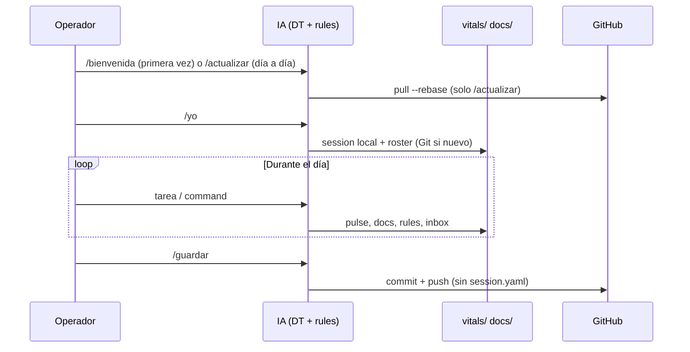

# Cerebro del equipo — mecanismos DT, Git, sesiones y commands

## Para qué existe este documento

Este repositorio no es solo una plantilla: es el **cerebro compartido** del equipo que usa El DT — memoria versionada, reglas para que varias personas no se pisen, y una IA que **pregunta quién sos** y **sabe qué no debe subir a Git**.

Manual rápido visible: [README.md](../../README.md). Marco del framework: [README del repo raíz](../../README.md) y portal [docs/README.md](../README.md) (`DOC-OV-001`).

**Índice rápido**

1. [Cómo pensamos el repo](#1-cómo-pensamos-el-repo)
2. [Git: qué se commitea y qué NO](#2-git-qué-se-commitea-y-qué-no)
3. [Sesiones e identidad](#3-sesiones-e-identidad)
4. [Configuración](#4-configuración)
5. [Arquitectura command → skill](#5-arquitectura-command--skill)
6. [Commands de rutina](#6-commands-de-rutina)
7. [Commands de trabajo y framework](#7-commands-de-trabajo-y-framework)
8. [Cómo habla y actúa la IA](#8-cómo-habla-y-actúa-la-ia)
9. [Evolución y Vitals](#9-evolución-y-vitals)
10. [Mapa de archivos](#10-mapa-de-archivos)
11. [Puntos ciegos](#11-puntos-ciegos)
12. [FAQ](#12-faq)
13. [Checklist de jornada](#13-checklist-de-jornada)

---

## 1. Cómo pensamos el repo

| Idea | En la práctica |
|------|----------------|
| **Un lugar, muchas personas** | Git es la memoria compartida; trabajo personal opcional en `vitals/work/inbox/{id}/`. |
| **La máquina no es la persona** | `vitals/ops/session.yaml` dice quién está **ahora** en esta laptop — **no** viaja por Git. |
| **Hablar antes de asumir** | Tras `/actualizar`, la IA **no** asume el operador anterior: pide `/yo`. |
| **Commands = atajos** | El usuario escribe `/guardar`; la IA ejecuta el skill. |
| **Lo pesado espera validación** | Cambios grandes: protocolo no-cómplice; `/fast-lane` solo con alcance cerrado. |
| **Dos ritmos** | **Rutina** (sincronizar e identidad) vs **Trabajo** (orquestar, PR, producto). |

### Ritmo diario



**Regla de oro (día a día):** `actualizar` → (`yo` si no hay sesión) → trabajar → `guardar`.

**Post-clone:** `bienvenida` → `yo` → trabajar → `guardar` — ver [primer-setup-dt.md](../02_guides/primer-setup-dt.md) (`DOC-GUIDE-006`).

---

## 2. Git: qué se commitea y qué NO

Fuente: [`.gitignore`](../../.gitignore).

| Path / patrón | ¿En Git? | Por qué |
|---------------|----------|---------|
| `vitals/ops/session.yaml` | **NO** | Quién está en **esta** máquina ahora |
| `vitals/ops/README.md` | **SÍ** | Referencia de forma (sin placeholders commiteados) |
| `vitals/config/roles.yaml` | **SÍ** | Roles opcionales del **proyecto** (`roles: []` al inicio) |
| `vitals/config/roster.yaml` | **SÍ** | Equipo registrado |
| `vitals/workspace.yaml` | **NO** | Multi-repo local |
| `vitals/workspace.yaml.example` | **SÍ** | Plantilla |
| `vitals/work/inbox/**/draft-*` | **NO** | Borradores locales |
| `vitals/work/inbox/{operator_id}/` | **SÍ** | Cuaderno personal (si se usa) |
| `.env`, `.env.local`, `*.credentials` | **NO** | Secretos |
| `.cursor/`, `.agent/`, `docs/`, skills | **SÍ** | Comportamiento IA |
| `node_modules/`, `dist/`, logs | **NO** | Build |

### Primera vez en una máquina

En el chat: **`/bienvenida`** → **`/yo`** con nombre y rol reales. **`/yo` crea** `vitals/ops/session.yaml` (sin plantilla con placeholders en el repo). No hace falta `/actualizar` en un clone recién hecho.

### Por qué `session.yaml` no se commitea

1. Privacidad operativa entre operadores en la misma laptop.
2. Evitar merges absurdos de identidad en Git.
3. El equipo persistente está en `roster.yaml` (sí en Git).
4. **`/actualizar` no toca** la sesión — solo sincroniza el remoto.

### Qué hace `/guardar`

El skill `git-guardar`:

- Verifica que `vitals/ops/session.yaml` no esté staged.
- `git reset HEAD vitals/ops/session.yaml` por si acaso.
- Nunca agrega `.env`, credenciales, `session.yaml`.
- Si `operator.id` es null → pedir `/yo` primero.

Detalle de zonas: [git-colaboracion-dt.md](../06_operations/git-colaboracion-dt.md) (`DOC-OPS-001`).

---

## 3. Sesiones e identidad

```text
┌─────────────────────────────────────────────────────────┐
│  roster.yaml (Git)     →  "Quiénes son del equipo"      │
│  session.yaml (local)  →  "Quién está en ESTA sesión"   │
└─────────────────────────────────────────────────────────┘
```

**Roles:** texto libre en `/yo`, o lista en `vitals/config/roles.yaml` si el equipo la define (`roles: []` en la plantilla base). Referencia: [dt-session-roster.md](../03_reference/dt-session-roster.md) (`DOC-REF-001`).

### Skill `dt-session` (`/yo`)

| Paso | Acción |
|------|--------|
| 1 | Si no hay archivo → crearlo al validar identidad |
| 2 | Si ya hay operador → "¿Seguís como {name}?" |
| 3 | Si no → "¿Quién está trabajando hoy?" + rol |
| 4 | `roster.yaml` si operador nuevo |
| 5 | Escribir **sesión completa** (`operator`, `inbox_path`, timestamps) + `mkdir` inbox |

**No commitea** `session.yaml`. Sin `/yo`, la IA debe **pedir identidad** antes de escribir (rule `06`).

### Metadata en pulse (`_meta` opcional)

En entradas nuevas de `vitals/pulse/entries/`:

```yaml
_meta:
  operator_id: <slug>
  operator_name: "<nombre>"
  role: "<rol de /yo>"
  created_at: "<ISO8601>"
  source: manual | orquestar | guardar
```

Regla: [`.cursor/rules/06-dt-colaboracion.mdc`](../../.cursor/rules/06-dt-colaboracion.mdc).

---

## 4. Configuración

### Multi-IDE

| IDE | Commands / workflows | Skills | Rules |
|-----|---------------------|--------|-------|
| **Cursor** | `.cursor/commands/*.md` | `.cursor/skills/` | `.cursor/rules/*.mdc` |
| **Antigravity** | `.agent/workflows/*.md` | `.agent/skills/` | `.agent/rules/` |
| **Claude Code** | `.claude/commands/*.md` | `.claude/skills/` | `.claude/rules/*.md` |
| **Codex** | — (skills) | `.agents/skills/` | — |
| **GitHub Copilot** | — | — | `.github/copilot-instructions.md` |

Post-clone: **`/bienvenida`** · Repair: **`/setup`** — [ide-setup.md](../02_guides/ide-setup.md) · [primer-setup-dt.md](../02_guides/primer-setup-dt.md).

### Fuente canónica de commands

[`vitals/config/commands-meta.yaml`](../../vitals/config/commands-meta.yaml) — grupos `routine`, `work`, `framework`. Mantenimiento: **YAML primero** → `./scripts/sync-commands-from-meta.sh` (ver [scripts/README.md](../../scripts/README.md)).

### Reglas que gobiernan a la IA

| Rule | Alcance |
|------|---------|
| `00-orquestador-core` | Personalidad DT, pipeline macro |
| `01-protocolos-dt` | No cómplice, alternativas, orden |
| `02-documentacion` | Protocolo `docs/` |
| `03-catalogo-subagentes` | 20 especialistas |
| `04-recomendacion-herramientas` | Sugerir commands |
| `05-multi-project-git` | Varios repos en workspace |
| **`06-dt-colaboracion`** | Sesión, zonas, commits |
| `90-seguridad-secrets` | Nunca commitear secretos |

### Entry points

| Archivo | Uso |
|---------|-----|
| [README.md](../../README.md) | Onboarding humano + tabla commands |
| [AGENTS.md](../../AGENTS.md) | Puerta IA: índice, sesión, commands |
| [vitals/INDEX.md](../../vitals/INDEX.md) | Pulso y specs DT |
| [docs/README.md](../README.md) | Portal documentación |

---

## 5. Arquitectura command → skill

```text
Usuario: /guardar
    ↓
.cursor/commands/guardar.md
    ↓
.cursor/skills/git-guardar/SKILL.md
    ↓
Git + vitals/ + docs/
```

Frontmatter típico (command de rutina):

```yaml
dt_command: guardar
group: routine
tagline: "Subí mi trabajo a GitHub."
skill: git-guardar
```

---

## 6. Commands de rutina

### `/bienvenida`

| | |
|--|--|
| **Skill** | `dt-setup` (modo first-run) |
| **Cuándo** | Justo después de clonar o abrir el DT por primera vez |
| **Qué hace** | Checklist markdown — verifica estructura multi-IDE; **no** requiere Ruby |
| **Después** | Recordar **`/yo`** |

### `/actualizar`

| | |
|--|--|
| **Skill** | `git-actualizar` |
| **Cuándo** | Al abrir el editor; antes de `/guardar` si estás behind |
| **Fase A** | `git fetch` + `git pull --rebase` de **origin** (proyecto/equipo) |
| **Fase B** | Consulta `dt-upstream` vía skill Markdown — compara `framework_version`; **solo avisa** (ofrece `/actualizar-dt`) |
| **Efecto local** | **No** crea ni modifica `session.yaml` |
| **Después** | Reportar novedades; si no hay sesión, recordar **`/yo`** |

Guía: [actualizar-framework-dt.md](../02_guides/actualizar-framework-dt.md) (`DOC-GUIDE-007`).

### `/yo`

| | |
|--|--|
| **Skill** | `dt-session` |
| **Escribe** | `session.yaml` (local), `roster.yaml` si nuevo |
| **Crea** | `vitals/work/inbox/{id}/` |

### `/guardar`

| | |
|--|--|
| **Skill** | `git-guardar` |
| **Pre-requisitos** | `session.yaml` con `operator.id` |
| **Staging** | Cambios del operador + `docs/`, `.cursor/`, `.agent/` si tocados |
| **Excluye** | `session.yaml`, `.env`, credenciales |
| **Versión** | Bump patch en `VERSION` si cambió normativa DT (rules, vitals/specs, commands-meta) |
| **Push** | `git push origin HEAD`; si falla → `/actualizar` y reintentar |

Ejemplo de mensaje de commit:

```text
dt(<operator_id>): pulse y docs protocolo sesión

Operador: <nombre> (<rol>)
Archivos: vitals/pulse, docs/00_overview
Versión template: <VERSION>
```

---

## 7. Commands de trabajo y framework

| Command | Grupo | ¿Necesita /yo? |
|---------|-------|----------------|
| `/orquestar` | work | Recomendado |
| `/fast-lane` | work | Recomendado |
| `/cuestionar` | work | No |
| `/contexto` | work | No |
| `/prepr` | work | Recomendado |
| `/setup` | framework | No |
| `/bootstrap` | framework | Sí (recomendado) |
| `/actualizar-dt` | framework | Recomendado |
| `/github-save-small` | framework | Sí |

Listado completo y taglines: `vitals/config/commands-meta.yaml`.

---

## 8. Cómo habla y actúa la IA

- **Conversacional** en commands de rutina (español por defecto en confirmaciones).
- **No cómplice** salvo `/fast-lane` con alcance cerrado.
- **Entrega:** resumen + cambios + puntos ciegos.
- Tras `/actualizar`: no confiar en operador previo.
- `session.yaml` vacío: pedir `/yo`.
- Secrets en diff: detener; no commitear.

**Precedencia:** [precedence.md](../../vitals/specs/precedence.md) — seguridad → comando explícito → no-cómplice → multi-proyecto.

---

## 9. Evolución y Vitals

| Hito | Mecanismo |
|------|-----------|
| v1.0–v1.4 | Orquestador, Vitals, multi-IDE, docs portal |
| v1.5 | Sesión local, `/actualizar` `/yo` `/guardar`, `commands-meta`, DOC-OV-004 |
| v1.5.1 | Sync multi-IDE, sesión solo con `/yo`, `github-save-release` |
| v1.5.2 | `/actualizar` solo Git; rule identidad en conversación; sin pre-commit |
| v1.7.0 | **Orden continuo + multi-IDE inclusivo:** fuente única total (`rule-bodies/` + `rules-manifest.yaml`), `ide-targets.yaml`, `dt-doctor`, catálogo derivado (`sync-catalog`), emisor único `sync-ide` (Cursor, Antigravity, Claude, Codex, Copilot), regla `07-orden-continuo` (loop autónomo), `/setup` no destructivo, `/bootstrap` |
| v1.7.2 | **Upstream DT:** Fase B en `/actualizar`, `/actualizar-dt`, config `dt-upstream.md`, instrucciones Markdown en skills, DOC-GUIDE-007 |

Reutilizar en otro proyecto: [adopt-dt-in-existing-repo.md](../02_guides/adopt-dt-in-existing-repo.md).

---

## 10. Mapa de archivos

```text
.gitignore
README.md / AGENTS.md
VERSION

vitals/
  config/commands-meta.yaml, roster.yaml
  ops/README.md, session.yaml (local)
  config/roles.yaml (opcional, vacío al inicio)
  pulse/, memory/, specs/
  work/inbox/{id}/

.cursor/  .agent/
docs/     DOC-OV-004, DOC-OPS-001, …
```

---

## 11. Puntos ciegos (mitigaciones en repo)

| Riesgo | Mitigación implementada |
|--------|-------------------------|
| Trabajar sin identidad | Rule `06` + orquestador: pedir **`/yo`** en conversación |
| `session.yaml` en Git | `.gitignore` + `git-guardar` no lo stagea |
| Drift commands entre IDEs | `sync-commands-from-meta.sh` → Cursor + Antigravity |
| Drift skills entre IDEs | `sync-skills-parity.sh` |
| Operador null en commit | `git-guardar` exige sesión válida |
| Adopción pesada | [Adopción mínima](../02_guides/adopt-dt-in-existing-repo.md#adopción-mínima-solo-ritual-git) |

---

## 12. FAQ

**¿Cómo creo la sesión?**  
Solo con **`/yo`** — crea `session.yaml`, inbox y roster si aplica.

**¿`/yo` sube a GitHub?**  
No. `session.yaml` es local. `/guardar` sube el resto (p. ej. roster nuevo).

**¿Qué hace `/actualizar`?**  
Solo `git pull`. No borra ni crea sesión.

**¿Puedo commitear session.yaml?**  
No. Solo en tu máquina.

**¿Nuevo command o skill?**  
Entrada en `commands-meta.yaml` + `sync-commands-from-meta.sh` y `sync-skills-parity.sh`.

---

## 13. Checklist de jornada

### Post-clone (primera vez)

- [ ] `/bienvenida`
- [ ] `/yo`
- [ ] Confirmar que la IA muestra tu nombre y rol

### Al abrir (día a día)

### Durante el día

- [ ] Trabajar con `/orquestar` o `/fast-lane` según alcance
- [ ] Cada bloque cerrado → `/guardar`

### Al cerrar (2 min)

- [ ] `/guardar` con confirmación de push
- [ ] Si falló push → `/actualizar` → resolver → `/guardar`

**Tarjeta mínima:** `actualizar → yo → trabajar → guardar` — `session.yaml` = solo en tu PC.

## Related docs

- [Colaboración Git](../06_operations/git-colaboracion-dt.md) (`DOC-OPS-001`)
- [Adoptar El DT](../02_guides/adopt-dt-in-existing-repo.md) (`DOC-GUIDE-003`)
- [Vitals](../01_concepts/dt-vitals.md) (`DOC-CONCEPT-001`)
